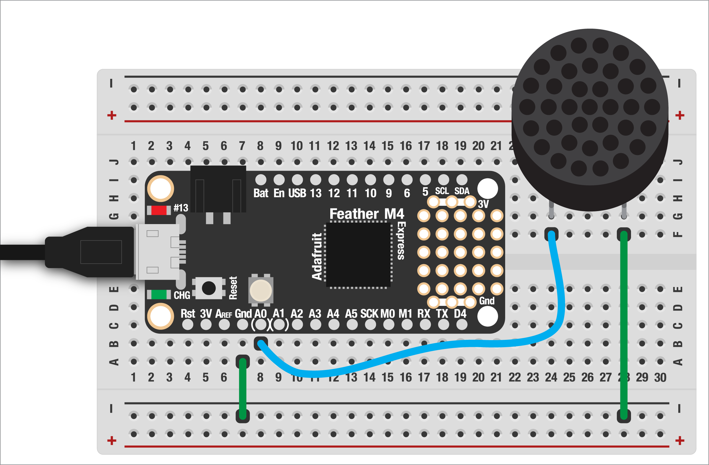

# GENERATING TONES

So far, the only output device we've looked as has been LEDs. And while we'll get to motors soon, the next few examples walk you through how to generate audio (and later video) right from your Feather board!

To get us started, we'll look at how to create basic tones (aka notes of varying frequencies). The nice thing is that this makes a super loud signal so we don't need any kind of amplification. The tradeoff is way less control over how it sounds, loudness, etc.

You can read more about audio output and the libraries used here:

* [Audio output](https://learn.adafruit.com/circuitpython-essentials/circuitpython-audio-out)  
* The [`simpleio` library](https://docs.circuitpython.org/projects/simpleio/en/latest/api.html#module-simpleio)  

***

### CONTENTS  

* [Basic setup](#basic-setup)  
* [Playing melodies](#playing-melodies)  
* [Full code example](#full-code-example)  
* [Challenges](#challenges)

### STUFF YOU'LL NEED  

* Breadboard-friendly speaker  
* Jumper wires  
* Feather board  
* USB cable  

***

### BASIC SETUP  

The circuit for this example is super simple! All we'll need is a speaker, with one leg connected to `A0` and the other to ground.



These speakers aren't polarized, so you can wire them up in either orientation.

We'll also need to add the `simplio` library to our board, then import it with the other required libraries:

```python
import board
import digitalio

from simpleio import tone
from adafruit_debouncer import Debouncer
```

***

### MAKING TONES  

With everything wired up, let's first connect our button:

```python
button_pin = digitalio.DigitalInOut(board.D5)
button_pin.pull = digitalio.Pull.UP
button = Debouncer(button_pin)
```

We also need to set up the audio output. This can be on analog pins `A0` or `A1`, or both if you want stereo audio! (Of course, you'll need two speakers for that.)

```python
audio_pin = board.A0
```

Now we can read the button and, when it's pressed, generate a tone. All we need to add is the frequency (pitch) and duration (how long it should play for, in seconds):

```python
while True:
  button.update()

  if button.fell:
    tone(
      audio_pin, 
      frequency = 220,
      duration = 0.5
    )
```

Press the button and you should hear sound for a half a second!

***

### PLAYING MELODIES

Random pitches are fine, but what if we wanted to play a melody? No problem! The `simpleio` library needs pitches measured in [*hertz*](https://en.wikipedia.org/wiki/Hertz), which is how many times the audio wave vibrates per second. 

But since most of us think in terms of notes on a keyboard, we'll need to convert those notes in to frequencies. We could do the conversion in code, but for this example we'll just [look it up online using this handy table](https://pages.mtu.edu/~suits/notefreqs.html).

For example, here's the first line to *Happy Birthday*:

    D D E D G F#

In the chart, you'll see the note name followed by a number. That's the octave, or where on the scale that note is found. Using `4` will give us a nice middle-scale to work with, which gives us these frequencies:

```python
freqs = [ 293.66, 293.66, 329.63, 293.66, 392.0, 369.99 ]
```

Put into a list, we can use a for-loop to play them when the button is pressed!

```python
while True:
  button.update()
  if button.fell:
    for f in freqs:
      tone(audio_pin, frequency=f, duration=0.2)
```

Not too shabby, but very robotic. That's because the duration of the notes was all exactly the same. Going back to our list of frequencies, let's group each note with a duration value:

```python
notes = [ 
  (293.66, 0.2),  # a "tuple"!
  (293.66, 0.1),  # stores the freq at index 0
  (329.63, 0.4),  # and the duration at index 1
  (293.66, 0.4),
  (392.00, 0.4),
  (369.99, 0.8) 
]
```

We can then grab the frequency and duration in the for-loop, playing each note:

```python
for note in notes:
  tone(
    audio_pin, 
    frequency = note[0], 
    duration =  note[1]
  )
```

> 🙋‍♀️ Ok this is cool but what about audio files? Yes, we can do that! We'll cover how to load and play mp3 files in the next example

***

### FULL CODE EXAMPLE  

```python
import board
import digitalio

from simpleio import tone
from adafruit_debouncer import Debouncer

audio_pin = board.A0

button_pin = digitalio.DigitalInOut(board.D5)
button_pin.pull = digitalio.Pull.UP
button = Debouncer(button_pin)

notes = [ 
  (293.66, 0.2),
  (293.66, 0.1),
  (329.63, 0.4),
  (293.66, 0.4),
  (392.00, 0.4),
  (369.99, 0.8) 
]

while True:
  button.update()
  if button.fell:
    tone(
      audio_pin,
      frequency = 220,
      duration = 0.1
    )

    # a more complex example, playing a
    # melody with freq/duration
    # for note in notes:
    #   tone(
    #     audio_pin, 
    #     frequency = note[0], 
    #     duration =  note[1]
    #   )
```

***

### CHALLENGES  

1. Can you add the next line in *Happy Birthday*?  
2. Can you find the formula to convert notes into frequencies? Try implementing it as a function!  

