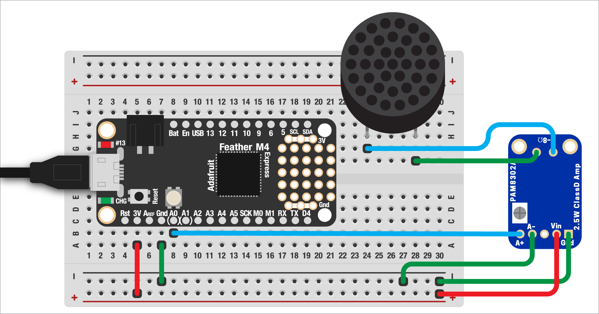

# PLAYING MP3s

As we just saw, playing simple tones is super easy with the Feather. But what about more complex audio like music or sound effects? Luckily, Adafruit has created very easy functionality to load and play MP3 files!

Up until recently, the [MP3 format](https://en.wikipedia.org/wiki/MP3) was held in lockdown by patent rules, but those have recently expired meaning we get free access to store and play compressed audio files... sweet!

***

### CONTENTS  

* [Wiring it up](#wiring-it-up)  
* [Preparing your file](#preparing-your-file)  
* [Playing it](#playing-it)  
* [Full code example](#full-code-example)  
* [Challenges](#challenges)

### STUFF YOU'LL NEED  

* Small speaker  
* Audio amplifier  
* Jumper wires  
* Feather board  
* USB cable  

***

### WIRING IT UP  

Unlike the simple tone playback we did earlier, playing an MP3 file will require an audio amplifier. The output from our Feather just isn't enough to push the speaker's cone, but an amplifier takes that weak signal and boosts it so it can be heard. It won't break anything to try without an amp, but you'll probably just hear very quiet, garbled audio.

I really like [this tiny amplifier from Adafruit](https://www.adafruit.com/product/2130). It's only $4USD, runs on 3.3 volts, and has a small volume potentiometer built right in! This [stereo amplifier board](https://www.adafruit.com/product/987) is also quite good and under $10.



The amplifier board needs power and ground, plus the audio signal and and out. Connect `A0` and `GND` to the audio input and two wires running out to your speaker. Audio connections are generally not polarized, so you can usually hook them up either way!

***

### PREPARING YOUR FILE  

The limitations of the Feather mean we can't play all files in the MP3 format, but most seem to work for me. The easiest way to check is just to try them – if it works, great!

We can also check the settings of our file first. For Mac users, click the file and press `Cmd + I` to see info about the file. We need the following settings:

* Bit rate: `16–320kb/s`  
* Sample rate: `16–44.1kHz`  
* Stereo or mono is fine  

If your file isn't in the right format, no worry! With a little work, we can modify an existing audio clip into the right format using the free software [Audacity](https://www.audacityteam.org/download/). We won't get into that but you can [read more about the process here](https://manual.audacityteam.org/man/mp3_export_options.html).

***

### PLAYING IT  

With our MP3 file ready, we can import the required libraries:

```python
import board
import audioio
import audiomp3
```

Then we can load the MP3 file:

```python
with open('burp.mp3', 'rb') as f:
  mp3 = audiomp3.MP3Decoder(f)
  speaker = audioio.AudioOut(board.A0)
```

And play it!

```python
speaker.play(mp3)

# wait until the file has finished
print('playing...')
while speaker.playing:
  pass
print('done!')
```

This plays automatically when the Feather boots up, pauses while playing, then stops.

***

### FULL CODE EXAMPLE  

```python
import board
import audioio
import audiomp3

# open the file and set A0 as the output
with open('burp.mp3', 'rb') as f:
  mp3 = audiomp3.MP3Decoder(f)
  speaker = audioio.AudioOut(board.A0)

# play it!
speaker.play(mp3)

# wait until the file has finished
print('playing...')
while speaker.playing:
  pass
print('done!')
```

***

### CHALLENGES  

1. Can you add a button to trigger the MP3 file to play? Or some other sensor?  

