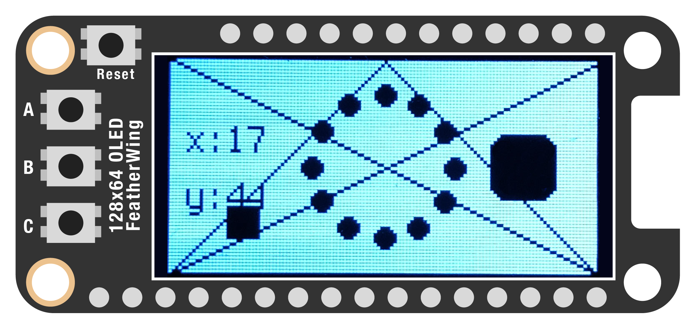
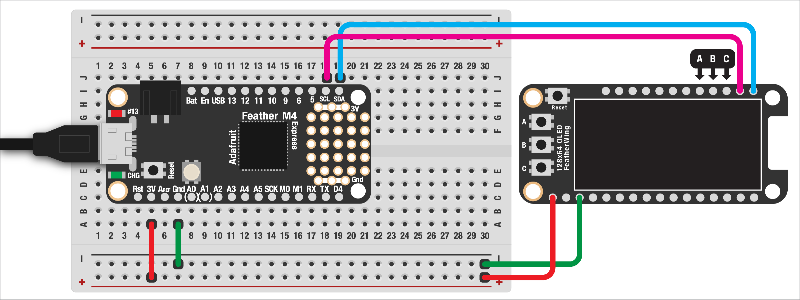

# VIDEO BASICS

We've seen how a simple LED can communicate a lot, but video screens open up tons of possibilities: interactive menus, easter eggs, little animations, all kinds of stuff! This demo assumes you're using a 124x64-pixel [organic LED](https://en.wikipedia.org/wiki/OLED) (OLED) screen from Adafruit. This device is monochrome, so it can only produce black or white pixels, but it's cheap and we can do a lot of cool stuff with it.

> 🙀 This is a loooong demo, mostly because there's a lot of code required. Don't worry though, once you understand the basics the next few demos will all build on what we do here.

When we're done, you should end up with an image that looks like this:



If you want to read more about the libraries used here, check out:  

* [`displayio`](https://docs.circuitpython.org/en/7.2.x/shared-bindings/displayio/), used to drive the display  
* Adafruit's [`display-shapes`](https://docs.circuitpython.org/projects/display-shapes/en/latest/index.html
), which makes drawing various shapes much easier  

***

### CONTENTS  

* [Copy the libraries](#copy-the-libraries)  
* [Connect the display using I2C](#connect-the-display-using-i2c)  
* [Configuring the display](#configuring-the-display)  
* [Changing the background color](#changing-the-background-color)  
* [Drawing lines](#drawing-lines)  
* [Animating shapes](#animating-shapes)  
* [Drawing other shapes](#drawing-other-shapes)  
* [Drawing text](#drawing-text)  

* [Full code example](#full-code-example)  
* [Challenges](#challenges)

### STUFF YOU'LL NEED  

* [128x64 monochrome OLED display](https://www.adafruit.com/product/4650)  
* Joystick (optional)  
* Jumper wires  
* Feather board  
* USB cable  

***

### COPY THE LIBRARIES  
To get video output from our Feather, we need several libraries. To get started, we'll need both of these:  

* `adafruit_bus_device`  
* `adafruit_displayio_sh1107`  

Additionally, we'll be using these in a bit, so let's grab them now:  

* `adafruit_display_shapes`  
* `adafruit_display_text`  

Copy everything to your Feather's `lib` folder.

***

### CONNECT THE DISPLAY USING I2C  
To communicate with our display, we'll be using a protocol called [*I2C*](https://en.wikipedia.org/wiki/I%C2%B2C) (usually pronounced "eye squared see"). This uses only two wires for communication, plus power and ground, which is great when we also want to include sensors and other components! I2C has some other fantastic features, like allowing us to chain multiple devices.

Connect up the `3V` and `GND` to the Feather, followed by wires going from `SCL` and `SDA` (the pins specifically for I2C) to the display, like this:  

  

If you power on your Feather, you should see the REPL text that normally appears in the console.

***

### CONFIGURING THE DISPLAY  
With the display wired up, let's configure it in code. First, import the code library for driving the display (this handles all the messy stuff for us) and a few others that we'll need:

```python
import adafruit_displayio_sh1107
import board
import displayio
```

Next, let's define some variables that we'll need. First is the size of the diplay in pixels. We'll use that later to position elements onscreen.

```python
width =  128
height = 64
```

Before actually starting up the display, we want to get rid of any settings or connections that might have persisted since the last time we used it:

```python
displayio.release_displays()
```

Now we can connect the display!  

```python
i2c = board.I2C()
display_bus = displayio.I2CDisplay(i2c, device_address=0x3C)

display = adafruit_displayio_sh1107.SH1107(
    display_bus, 
    width =    width, 
    height =   height, 
    rotation = 0
)
```

We don't have to worry too much about what's going on here, except that we're creating a variable `display` that we'll use later to talk with the screen.

***

### CHANGING THE BACKGROUND COLOR  
The way these little displays work is kind of an engineering marvel: with super minimal power and only two wires, we can make very fast graphics. The tradeoff for this is that the display uses a really funky way of organizing everything. The [Adafruit `displayio` guide goes over this is detail](https://learn.adafruit.com/circuitpython-display-support-using-displayio/library-overview), but it's tremendously confusing so you shouldn't need to look at it unless you're interested in how this all works.

First, we're going to create a *group*, which we can think of as a collection of all the stuff we're going to show onscreen. I'm calling mine "frame" and will do the same throughout all the upcoming demos.

```python
frame = displayio.Group()
display.show(frame)
```

The first change we'll make is the background color. To make this easier, let's define some colors as variables:

```python
white = 0xFFFFFF
black = 0x000000
```

These values are listed in [*hexadecimal* format](https://en.wikipedia.org/wiki/Hexadecimal). You might be used to seeing black as `rgb(0,0,0)` and white as `rgb(255,255,255)`... this is the same, just written in another way! (And, since our screen is only monochrome, this is all we need.)

To make things easier, I've gone ahead and built a bunch of helper functions that you can just copy/paste into your project! Add this function into your code, somewhere above where you're going to use it:

```python
def background(color):
  bitmap =  displayio.Bitmap(width, height, 1)
  palette = displayio.Palette(1)
  palette[0] = color
  bg = displayio.TileGrid(
    bitmap,
    pixel_shader = palette,
    x = 0,
    y = 0
  )
  frame.append(bg)
```

This creates a *bitmap*, really just a list of pixels, and adds that to our frame. (You don't have to worry about what's going on in this function!)

To change the color of those pixels, we can just call the `background()` function:

```python
background(white)
```

If we add a while-loop at the bottom, you should see the screen fill with white!

***

### DRAWING LINES  
We'll see in upcoming examples how to draw everything from images to animations, but let's start with some basic shapes. We could roll our own graphics library (a fun challenge!) but Adafruit already has one set up for us. Let's import everything at once:

```python
from adafruit_display_shapes.line import Line
from adafruit_display_shapes.rect import Rect
from adafruit_display_shapes.circle import Circle
from adafruit_display_shapes.triangle import Triangle
from adafruit_display_shapes.polygon import Polygon
from adafruit_display_shapes.roundrect import RoundRect
```

The library is great, but is still kind of messy. Like with the `background()` command above, I've gone ahead and made functions for everything. Let's start by adding the `line()` function to our project:

```python
def line(x0, y0, x1, y1, color):
  l = Line(int(x0),int(y0), int(x1),int(y1), color)
  frame.append(l)
  return l
```

**Two important things to note!**  

1. All coordinates and sizes need to be listed as integers. That's because you can't have a shape at `x: 1.5`!  
2. The helper functions all assume you have a variable called `frame` that you created at the top. If you named your Group something else, use that instead  

Now we can go ahead and draw some lines! If you've used `p5.js` or Processing before, the syntax will look very similar: the command requires four values, making up the x/y coordinates of the two endpoints, plus the color we'd like to use:

```python
l1 = line(0,0, width,height, black)
l2 = line(0,height, width,0, black)
```

This function does two things: it creates the line and adds it to our display, but it also returns it as a variable. We'll see later how useful this is when we want our display to react to a user input.

If you save your code, you should now see two black lines going from corner-to-corner!

***

### ANIMATING SHAPES  

Static shapes are fine, but we can also make them react to user input! Let's start by making a square that the user can move around with a joystick.

```python
def rect(x, y, w, h, fill, outline, center=False):
  if center:
    x -= w/2
    y -= h/2
  r = Rect(
    int(x), int(y),
    int(w), int(h),
    fill = fill,
    outline = outline
  )
  frame.append(r)
  return r

player = rect(
  0, 0,             # x/y position
  10, 10,           # width and height
  fill = black,     # fill color
  outline = black,  # outline color
  center = True     # put x/y at the center?
)
```

This creates a rectangle, with the name `player`. It's position is `(0,0)`, it's a 10-pixel square, and is filled black with no outline. I've also added an option to draw the rectangle from the center, rather than the upper-left corner.

Since we're going to move this shape with an analog sensor, we'll need a few more things. First, add these libraries:

```python
import analogio
import time
```

Let's also add the `scale()` and `constrain()` functions we used previously:

```python
def scale(n, in_min, in_max, out_min, out_max):
  val = (((n - in_min) * (out_max - out_min)) / (in_max - in_min)) + out_min
  return val

def constrain(val, min_val, max_val):
  return min(max_val, max(min_val, val))
```

Now we can set up the joystick on pins `A4` and `A5`:  

```python
joystick_y = analogio.AnalogIn(board.A5)
joystick_x = analogio.AnalogIn(board.A4)
```

Finally, let's read the values from the joystick in our while-loop, scaling them to the screen's dimensions. We can then modify the player's x/y position to match:

```python
while True:
  x = joystick_y.value
  x = scale(x, 0,65535, 0,width-player.width+1)
  player.x = int(x)

  y = joystick_x.value
  y = scale(y, 0,65535, height-player.height+1,0)
  player.y = int(y)

  # a small delay means a smoother animation
  # (though you can experiment with this value)
  time.sleep(0.02)
```

You should now see a black rectangle that moves around as you move the joystick!

***

### DRAWING OTHER SHAPES

The shape library also offers us circles, rectangles, rounded rectangles, and triangles! (We can also draw polygons, though we'll see that in the next example.) Once again, add these helper functions to your project:

```python
def circle(cx, cy, r, fill, outline):
  c = Circle(
    int(cx), int(cy),
    int(r),
    fill = fill,
    outline = outline
  )
  frame.append(c)
  return c

def rounded_rect(x, y, w, h, r, fill, outline, center=False):
  if center:
    x -= w/2
    y -= h/2
  rr = RoundRect(
    int(x), int(y),
    int(w), int(h),
    int(r),
    fill = fill,
    outline = outline
  )
  frame.append(rr)
  return rr

def triangle(x0,y0, x1,y1, x2,y2, fill, outline):
  t = Triangle(
    int(x0), int(y0),
    int(x1), int(y1),
    int(x2), int(y2),
    fill = fill, 
    outline = outline
  )
  frame.append(t)
  return t
```

Now we can create some shapes. A rounded rectangle, which uses the same syntax as above but with a radius specified:

```python
rr = rounded_rect(
  width-width/6, height/2,
  20, 20,
  5,
  fill = black,
  outline = None,
  center = True
)
```

We can make triangles too:

```python
t = triangle(
  width/2, 0,
  width, height,
  0, height,
  fill = None,
  outline = black
)
```

Or an array of circles... in a circle!

```python
from math import sin, cos, radians

circles = []
for a in range(0, 360, 30):
  x = width/2 + cos(radians(a)) * height/3
  y = height/2 + sin(radians(a)) * height/3
  circles.append(circle(x,y, 3, black, None))
```

You might notice that our player's square is behind these shapes. That's because the order we add shapes matters! Newer shapes are drawn on top of older ones, so if we want our player on top, we'd want to create that last.

> 🙋‍♀️ What's with that weird `sin/cos` forumula? We'll talk about this more in the next example!

***

### DRAWING TEXT

Lastly, we can also draw text onscreen. This is great for user feedback, seeing a variable's value, etc. First, we'll import the necessary libraries and helper function:

```python
import terminalio
from adafruit_display_text import label

def text(text, x, y, color, scale=1):
  text_area = label.Label(
    terminalio.FONT,
    text = text,
    color = color,
    x = int(x),
    y = int(y),
    scale = scale
  )
  frame.append(text_area)
  return text_area
```

Then we can create the text as a variable. Just like with the player, this allows us to change the text's value later:

```python
label = text('', 5,height/2-9, black)
```

You'll also notice there's no text! We'll change that in our loop:

```python
label.text = 'x:' + str(player.x) + '\ny:' + str(player.y)
```

***

### FULL CODE EXAMPLE  

```python
import analogio
import board
import displayio
from math import sin, cos, radians
import time

# screen, shape, and text librarires
import adafruit_displayio_sh1107

from adafruit_display_shapes.line import Line
from adafruit_display_shapes.rect import Rect
from adafruit_display_shapes.circle import Circle
from adafruit_display_shapes.triangle import Triangle
from adafruit_display_shapes.roundrect import RoundRect

import terminalio
from adafruit_display_text import label

# connect a joystick
joystick_y = analogio.AnalogIn(board.A5)
joystick_x = analogio.AnalogIn(board.A4)

# colors, defined as hexadecimal values
white = 0xFFFFFF
black = 0x000000

# basic display settings
# (don't change these, but they'll be
# helpful for us later)
width =  128
height = 64

# get rid of any displays or their settings
# that might have been previously connected
displayio.release_displays()

# connect to the display via I2C protocol
i2c = board.I2C()
display_bus = displayio.I2CDisplay(i2c, device_address=0x3C)

display = adafruit_displayio_sh1107.SH1107(
    display_bus, 
    width =    width, 
    height =   height, 
    rotation = 0
)

# create a 'group' for our shapes to
# go in and add them to the display
frame = displayio.Group()
display.show(frame)


# helper functions!
# skip down to see them in use...
def background(color):
  bitmap =  displayio.Bitmap(width, height, 1)
  palette = displayio.Palette(1)
  palette[0] = color
  bg = displayio.TileGrid(
    bitmap,
    pixel_shader = palette,
    x = 0,
    y = 0
  )
  frame.append(bg)

def line(x0, y0, x1, y1, color):
  l = Line(int(x0),int(y0), int(x1),int(y1), color)
  frame.append(l)
  return l

def circle(cx, cy, r, fill, outline):
  c = Circle(
    int(cx), int(cy),
    int(r),
    fill = fill,
    outline = outline
  )
  frame.append(c)
  return c

def rect(x, y, w, h, fill, outline, center=False):
  if center:
    x -= w/2
    y -= h/2
  r = Rect(
    int(x), int(y),
    int(w), int(h),
    fill = fill,
    outline = outline
  )
  frame.append(r)
  return r

def rounded_rect(x, y, w, h, r, fill, outline, center=False):
  if center:
    x -= w/2
    y -= h/2
  rr = RoundRect(
    int(x), int(y),
    int(w), int(h),
    int(r),
    fill = fill,
    outline = outline
  )
  frame.append(rr)
  return rr

def triangle(x0,y0, x1,y1, x2,y2, fill, outline):
  t = Triangle(
    int(x0), int(y0),
    int(x1), int(y1),
    int(x2), int(y2),
    fill = fill, 
    outline = outline
  )
  frame.append(t)
  return t

def text(text, x, y, color, scale=1):
  text_area = label.Label(
    terminalio.FONT,
    text = text,
    color = color,
    x = int(x),
    y = int(y),
    scale = scale
  )
  frame.append(text_area)
  return text_area

def scale(n, in_min, in_max, out_min, out_max):
  # scale values from one range to another
  val = (((n - in_min) * (out_max - out_min)) / (in_max - in_min)) + out_min
  return val

def constrain(val, min_val, max_val):
  # keep numbers within range
  return min(max_val, max(min_val, val))


# change the background to all white
background(white)

# draw two lines from corner-to-corner
# arguments: two sets of x/y coordinates
l1 = line(0,0, width,height, black)
l2 = line(0,height, width,0, black)

# some other shapes...
rr = rounded_rect(
  width-width/6, height/2,  # x/y
  20, 20,                   # width/height
  5,                        # corner radius
  fill = black,             # fill color
  outline = None,           # outline color
  center = True             # draw from center or upper-left corner?
)

t = triangle(
  width/2, 0,         # first corner...
  width, height,      # second...
  0, height,          # third
  fill = None,
  outline = black
)

# we can create lists of shapes here too
# (this also does some fancy math to put
# the circles in a circular pattern!)
circles = []
for a in range(0, 360, 30):
  x = width/2 + cos(radians(a)) * height/3
  y = height/2 + sin(radians(a)) * height/3
  circles.append(circle(x,y, 3, black, None))

# order matters here!
# when we create these objects, they'll
# later be drawn in this order
# so: if we want our 'player' shape to
# be on top, we have to add it last!
player = rect(
  0, 0,
  10, 10,
  fill = black,
  outline = black,
  center = True
)

# some text too
label = text(
  '',               # text to display (we'll change later)
  5, height/2-9,    # x/y
  black             # fill color
)


while True:
  # read the joystick, scale the values to screen
  # coordinates, and move the player
  x = joystick_y.value
  x = scale(x, 0,65535, 0,width-player.width+1)
  player.x = int(x)

  y = joystick_x.value
  y = scale(y, 0,65535, height-player.height+1,0)
  player.y = int(y)

  # change color as we cross the center line
  if player.x < width/2:
    player.fill = black
  else:
    player.fill = white

  # display the player's coordinates
  label.text = 'x:' + str(player.x) + '\ny:' + str(player.y)

  # small delay = smoother animation
  # (try playing with this)
  time.sleep(0.02)
```

***

### CHALLENGES  

1. Can you have the player's rectangle change color when it crosses the middle of the screen? (Hint: change `player.fill` to be either `black` or `white`)  

