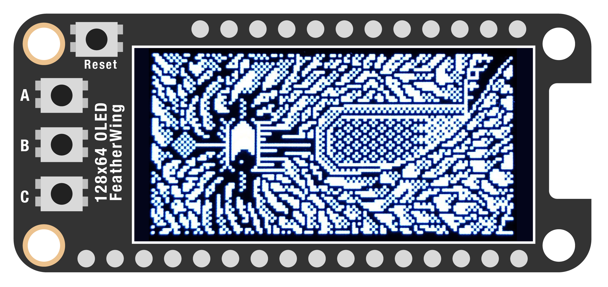
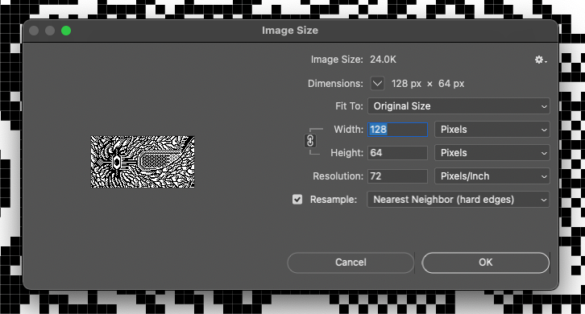
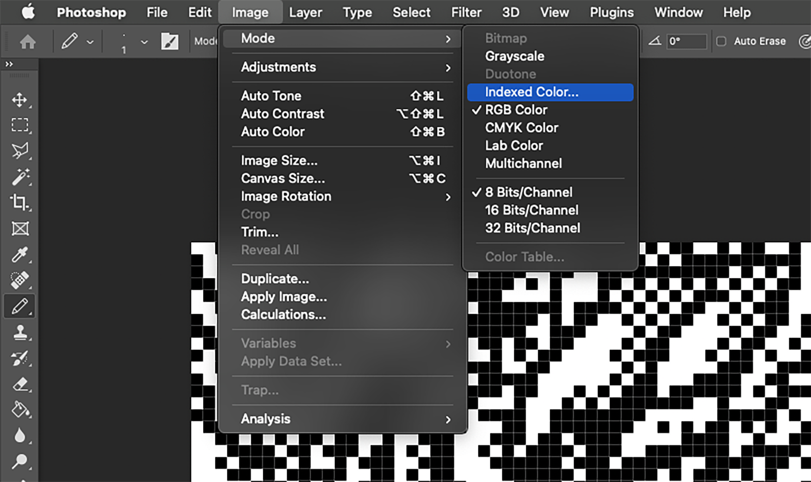
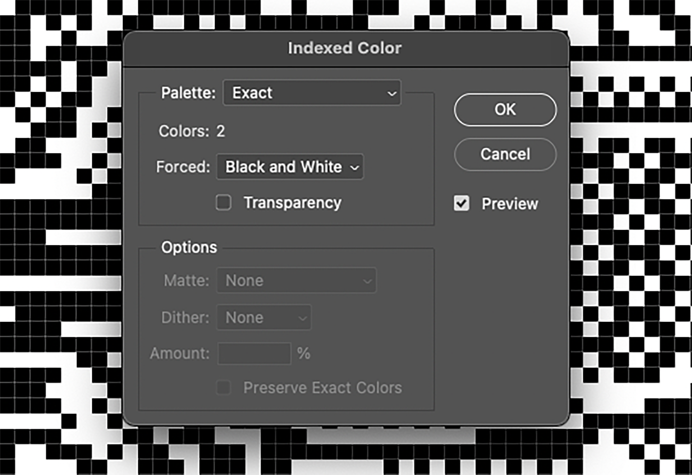
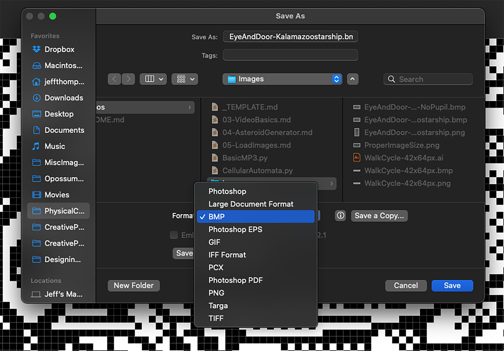

# LOAD IMAGES

Generating our own graphics is sweet, but what about more complex images like photos? We can easily do that! The image we're using is a (heavily cropped) version of [this wonderful pixel-art image](https://www.reddit.com/r/PixelArt/comments/mdtbwb/this_is_my_first_1_bit_piece_i_call_it_the_seeing/), created by Reddit user Kalamazoostarship.

When we're done, you should end up with an image that looks like this:



> 🎨 There's one major caveat to consider: our display is only monochrome, meaning it's pixels can only be black or white, no grayscale or color! Some images will translate better than others to this context... just something to keep in mind.

***

### CONTENTS  

* [Basic setup](#basic-setup)  
* [Prepare your image](#prepare-your-image)  
* [Load and display the image](#load-and-display-the-image)  
* [Adding animated elements](#adding-animated-elements)  
* [Full code example](#full-code-example)  
* [Challenges](#challenges)

### STUFF YOU'LL NEED  

* 128x64 monochrome OLED display  
* Jumper wires  
* Feather board  
* USB cable  

***

### BASIC SETUP  

Like in the previous example, let's start with some library imports:

```python
import board
import displayio
import time
import adafruit_displayio_sh1107
```

And let's go ahead and create the display:

```python
width =  128
height = 64

displayio.release_displays()
i2c = board.I2C()
display_bus = displayio.I2CDisplay(i2c, device_address=0x3C)
display = adafruit_displayio_sh1107.SH1107(
    display_bus, 
    width =    width, 
    height =   height, 
    rotation = 0
)
frame = displayio.Group()
display.show(frame)
```

***

### PREPARE YOUR IMAGE  

Because of the Feather's hardware limitations, we can only load images that are created in a certain way:

* `bmp` format only! (No `jpg`, `gif`, etc)  
* Indexed color (no RGB, etc)  
* Monochrome (2-color)  

Let's walk through how to do this in Photoshop. First, open your image and crop/resize it to the screen's dimensions. Use `Nearest Neighbor (hard edges)` to get the best results.

  

Then we change the color mode to `Indexed` color:

  

This will open a window with some options: choose `Colors: 2` to create a monochrome image:

  

Then go to `File → Save As...` and select `bmp`:



Your file should be ready to display!

***

### LOAD AND DISPLAY THE IMAGE  

With everything ready, let's see it! First, let's create a variable with the filename at the top (this ways it's easier to change later):

```python
filename = 'Images/EyeAndDoor-Kalamazoostarship-NoPupil.bmp'
```

Then we load the image file:

```python
file = displayio.OnDiskBitmap(filename)
```

Finally, grab the image data and put it into our display:

```python
image = displayio.TileGrid(
  file, 
  pixel_shader = file.pixel_shader
)
frame.append(image)
```

Adding a while-loop, we should see the image show up!

```python
while True:
  pass
```

> 🙋‍♀️ What's a `TileGrid`? This is part of the confusing way graphics are handled with these displays. A `TileGrid` is another object, kind of like the `Group` we create at the start, but split into pieces. You can read more about all this on [the Adafruit guide](https://learn.adafruit.com/circuitpython-display-support-using-displayio/library-overview).  

***

### ADDING ANIMATED ELEMENTS  

This image is super cool, but let's add an animated element: a pupil that moves back-and-forth! To do that, we'll use a circle (for the main pupil) and a rectangle (for a single-pixel highlight).

Let's start by adding the shape libraries:

```python
from adafruit_display_shapes.circle import Circle
from adafruit_display_shapes.rect import Rect
```

And creating the shapes. It took some experimentation for me to figure out the sizes and positions, so don't feel bad if it takes a few tries to get everything in the right place if you're working on something similar.

```python
pupil = Circle(
  32, int(height/2),
  3,
  fill = 0x000000,
  outline = None
)
frame.append(pupil)

highlight = Rect(
  31, int(height/2),
  1, 1,
  fill = 0xFFFFFF,
  outline = None
)
frame.append(highlight)
```

You should now see the pupil and highlight show up! We could make them move side-to-side using a bunch of different methods, but we can use `sin()` to give us some nice [easing](https://easings.net) on both ends. To make this work, we'll need a variable that keeps track of the current frame count:

```python
i = 0
```

Then we can adjust the pupil's `y` position in the loop:

```python
while True:
  pupil.y = int(height/2 - 2 + sin(i) * 6)
```

This looks super confusing, so let's break it down:

* `height/2 - 2`: the center of movement. This is offset by two pixels to center the pupil in the eye  
* `sin(i)`: gives us a value between `–1` and `1`  
* `* 6`: the maximum distance the eye should move; multiplied by `sin(i)` so it goes back-and-forth  
* `int(...)`: converts the result to an integer, which is required for positioning the circle  

But it doesn't move! That's because we haven't updated the value of `i` yet:

```python
while True:
  pupil.y = int(height/2 - 2 + sin(i) * 6)
  i += 0.15
  time.sleep(0.05)
```

Try changing the value added to `i` to adjust the speed of movement. Finally, let's make the pupil move with the eye:

```python
highlight.y = pupil.y + 4
```

The `+4` here is also the result of a bunch of testing to find the right offset.

***

### FULL CODE EXAMPLE  

```python
import board
import displayio
from math import sin
import time

import adafruit_displayio_sh1107
from adafruit_display_shapes.circle import Circle
from adafruit_display_shapes.rect import Rect

filename = 'EyeAndDoor-Kalamazoostarship-NoPupil.bmp'

width =  128
height = 64

# create the display
displayio.release_displays()
i2c = board.I2C()
display_bus = displayio.I2CDisplay(i2c, device_address=0x3C)
display = adafruit_displayio_sh1107.SH1107(
    display_bus, 
    width =    width, 
    height =   height, 
    rotation = 0
)
frame = displayio.Group()
display.show(frame)

# load the image
file = displayio.OnDiskBitmap(filename)
image = displayio.TileGrid(
  file, 
  pixel_shader = file.pixel_shader
)
frame.append(image)

# create the shapes for the pupil
pupil = Circle(
  32, int(height/2),
  3,
  fill = 0x000000,
  outline = None
)
frame.append(pupil)

highlight = Rect(
  31, int(height/2),
  1, 1,
  fill = 0xFFFFFF,
  outline = None
)
frame.append(highlight)

i = 0
while True:
  # each frame, move the eye offset from
  # the center using sin()
  pupil.y = int(height/2 - 2 + sin(i) * 6)
  highlight.y = pupil.y + 4
  
  # update variable for eye
  # try changing this value!
  i += 0.15

  time.sleep(0.05)
```

***

### CHALLENGES  

1. Could you use a joystick or potentiometer to move the eye instead?  
2. Try loading another image (or better yet, make your own!) and adding animated elements  

