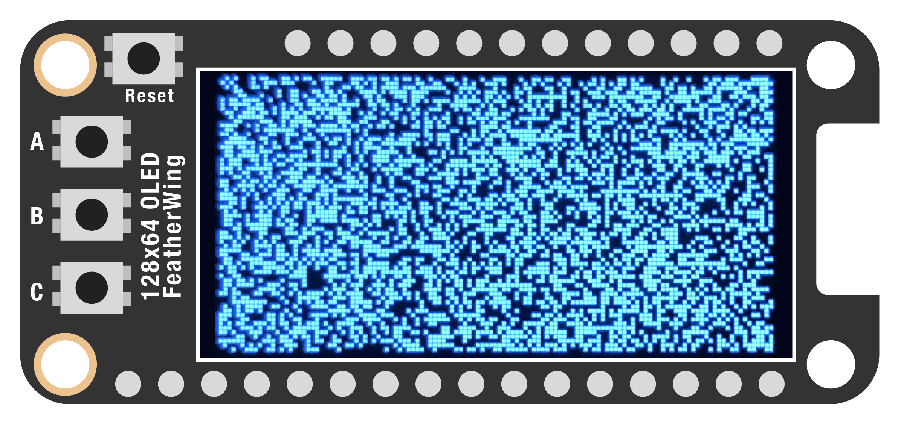

# PIXEL ACCESS

We've seen how to draw all kinds of shapes and even images, but what about pixel-level drawing? It's actually quite easy! This method isn't very fast, however, so forget about realtime filters or anything like that. 

Instead, we'll generate a white noise pattern, updated when a button is pressed. When we're done, you should end up with an image that looks like this:



***

### CONTENTS  

* [Basic setup](#basic-setup)  
* [Creating a bitmap](#creating-a-bitmap)  
* [Make some noise](#make-some-noise)  
* [Full code example](#full-code-example)  
* [Challenges](#challenges)

### STUFF YOU'LL NEED  

* 128x64 monochrome OLED display  
* Jumper wires  
* Feather board  
* USB cable  

***

### BASIC SETUP  

Once again, let's grab the usual libraries, then set up the button and display:

```python
import board
import digitalio
import displayio
from random import randint
import time

import adafruit_displayio_sh1107
from adafruit_debouncer import Debouncer

width =  128
height = 64

pin = digitalio.DigitalInOut(board.D5)
pin.pull = digitalio.Pull.UP
button = Debouncer(pin)

displayio.release_displays()
i2c = board.I2C()
display_bus = displayio.I2CDisplay(i2c, device_address=0x3C)
display = adafruit_displayio_sh1107.SH1107(
    display_bus, 
    width =    width, 
    height =   height, 
    rotation = 0
)
frame = displayio.Group()
display.show(frame)
```

***

### CREATING A BITMAP  

You've probably noticed the term *bitmap* used in some of the previous examples. As the name implies, a [bitmap](https://en.wikipedia.org/wiki/Bitmap) is literally a collection of bits, mapped to the various pixels of an image.

Unlike languages such as `p5.js`, we don't automatically get a set of pixels we can work with. Instead, we have to create them with a specified palette of colors.

```python
def create_pixels():
  pixels = displayio.Bitmap(width, height, 2)
  palette = displayio.Palette(2)
  palette[0] = 0x000000
  palette[1] = 0xFFFFFF
  frame = displayio.TileGrid(pixels, pixel_shader=palette)
  group = displayio.Group()
  group.append(frame)
  display.show(group)
  return pixels 

pixels = create_pixels()
```

This is a lot like the `background()` command we used earlier, but here we specify two different colors to be used: black, noted from here on out as `0`, and white, noted as `1`.

***

### MAKE SOME NOISE  

Now we're ready to change individual pixels! When we used the `create_pixels()` command, it sent back a list of pixel values. We can take a look at them individually by passing an `x/y` coordinate:

```python
print(pixels[10,10])
```

We can also change pixels this way! Let's make a function to fill the screen with random black or white pixels:

```python
def noise():
  for y in range(0, height):
    for x in range(0, width):
      pixels[x, y] = randint(0, 1)

noise()
```

Finally, we can generate new noise when the button is pressed:

```python
while True:
  button.update()
  
  if button.fell:
    noise()
```

***

### FULL CODE EXAMPLE  

```python
import board
import digitalio
import displayio
from random import randint
import time

import adafruit_displayio_sh1107
from adafruit_debouncer import Debouncer

width =  128
height = 64

# button input
pin = digitalio.DigitalInOut(board.D5)
pin.pull = digitalio.Pull.UP
button = Debouncer(pin)

# display setup
displayio.release_displays()
i2c = board.I2C()
display_bus = displayio.I2CDisplay(i2c, device_address=0x3C)
display = adafruit_displayio_sh1107.SH1107(
    display_bus, 
    width =    width, 
    height =   height, 
    rotation = 0
)
frame = displayio.Group()
display.show(frame)

# give us an array of pixels we can manipulate
def create_pixels():
  pixels = displayio.Bitmap(width, height, 2)
  palette = displayio.Palette(2)
  palette[0] = 0x000000
  palette[1] = 0xFFFFFF
  frame = displayio.TileGrid(pixels, pixel_shader=palette)
  group = displayio.Group()
  group.append(frame)
  display.show(group)
  return pixels 

# randomly assign black or white pixels
def noise():
  for y in range(0, height):
    for x in range(0, width):
      pixels[x, y] = randint(0, 1)

pixels = create_pixels()
print(pixels[10,10])

noise()
print(pixels[10,10])

while True:
  button.update()
  
  if button.fell:
    noise()
```

***

### CHALLENGES  

1. Can you create a function that draws a square onscreen at a specified location using only the pixel access? What other shapes can you draw?

