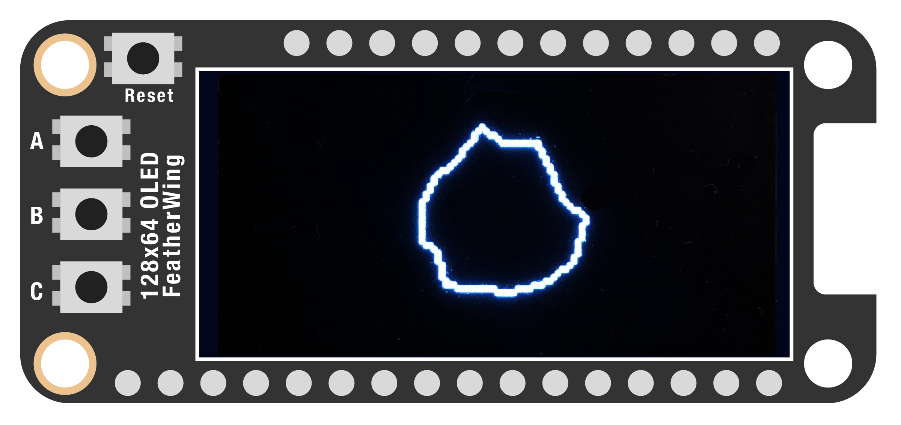
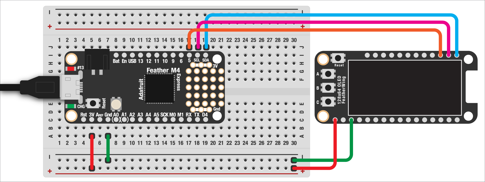

# ASTEROID GENERATOR  

Having seen how to connect our display and draw some shapes, let's make something! In this simple example, we'll draw randomized ["asteroid"](https://en.wikipedia.org/wiki/Asteroids_(video_game)) shapes when a button is pressed.

When we're done, you should end up with an image that looks like this:



This demo, like all the ones that follow it, will assume you already understand how to hook up your display using I2C and how to use the helper functions for drawing shapes. If you need a refresher, check out [the previous demo](02-VideoBasics.md).

***

### CONTENTS  

* [Basic setup](#basic-setup)  
* [Generate an asteroid](#generate-an-asteroid)  
* [New asteroid on button press](#new-asteroid-on-button-press)  
* [Full code example](#full-code-example)  
* [Challenges](#challenges)

### STUFF YOU'LL NEED  

* 128x64 monochrome OLED display  
* Jumper wires  
* Feather board  
* USB cable  

***

### BASIC SETUP  

We can start by importing the (many) libraries that we'll need:

```python
import board
import digitalio
import displayio
from math import sin, cos, radians
from random import uniform
import time

import adafruit_displayio_sh1107
from adafruit_display_shapes.polygon import Polygon

from adafruit_debouncer import Debouncer
```

Let's also connect the display:

```python
white = 0xFFFFFF
black = 0x000000

width =  128
height = 64

displayio.release_displays()
i2c = board.I2C()
display_bus = displayio.I2CDisplay(i2c, device_address=0x3C)
display = adafruit_displayio_sh1107.SH1107(
    display_bus, 
    width =    width, 
    height =   height, 
    rotation = 0
)
frame = displayio.Group()
display.show(frame)
```

And finally we'll need two helper function:

```python
def background(color):
  bitmap =  displayio.Bitmap(width, height, 1)
  palette = displayio.Palette(1)
  palette[0] = color
  bg = displayio.TileGrid(
    bitmap,
    pixel_shader = palette,
    x = 0,
    y = 0
  )
  frame.append(bg)

def polygon(points, outline):
  # requires a list of points in (x,y) tuple format
  # note: only supports outline, not fill
  p = Polygon(points, outline=outline)
  frame.append(p)
  return p
```

***

### GENERATE AN ASTEROID  

In the last example, we looked at various basic shapes. But what about making a randomized asteroid-like shape? Luckily, with a little math and Adafruit's `display-shapes` library we can make complex polygons. We'll make a function for this, since we want to be able to generate new asteroids when the button is pressed:

```python
def generate_asteroid(cx, cy, radius, mutation, color):
  points = []
  a = 0
  while a < 360:
    temp_r = radius + uniform(-mutation, mutation)
    x = cx + cos(radians(a)) * temp_r
    y = cy + sin(radians(a)) * temp_r
    points.append( (int(x), int(y)) )
    a += uniform(12, 30)
  points.append( points[0] )
  asteroid = polygon(points, color)
  return asteroid
```

> 🙋‍♀️ Woah, what's all this code?! This uses some magical math that lets us figure out an x/y position using a center point, a radius, and an angle of rotation. This is used a lot in computer graphics and is a great one to file away for later. To make the asteroid shape, we're rotating around the center, using some trigonometry to calculate the x/y position of the points. We mutate the radius a bit as we go around to give us a more asteroid-like appearance. Those points get packed together in a list and we have an asteroid!

Now we can set the background to black and generate an asteroid:

```python
background(black)

asteroid = generate_asteroid(
  width/2, height/2,   # x/y of center
  20,                  # radius
  3,                   # max mutation (amount in/out from a circle)
  white                # outline color (no fill for polygons)
)
```

Adding our while-loop, we should see a little random asteroid/blob!

```python
while True:
  pass
```

> 🙋‍♀️ Why do we need a while-loop? When the Feather reaches the end of our program, it quits. That means that it will draw the asteroid then immediately stop, including turning off the display. By adding this loop, which runs forever, the image will stay on the screen once it's been drawn.

***

### NEW ASTEROID ON BUTTON PRESS  

The OLED display also includes three buttons, which we can put to good use! Let's make the `C` button generate a new asteroid. 

First, let's wire up the button on `D5`:



And add it to our code:

```python
pin = digitalio.DigitalInOut(board.D5)
pin.pull = digitalio.Pull.UP
button = Debouncer(pin)
```

Now all we need to do is update the while-loop:

```python
while True:
  button.update()
  
  # if the button is pressed...
  if button.fell:
    # remove the previous asteroid shape
    frame.pop()

    # and generate a new one!
    asteroid = generate_asteroid(
      width/2, height/2, 20, 3, white
    )
  
  time.sleep(0.02)
```

Press the button and you should see a new asteroid drawn to the screen!

***

### FULL CODE EXAMPLE  

```python
import board
import digitalio
import displayio
from math import sin, cos, radians
from random import uniform
import time

import adafruit_displayio_sh1107
from adafruit_display_shapes.polygon import Polygon

from adafruit_debouncer import Debouncer


white = 0xFFFFFF
black = 0x000000

width =  128
height = 64

pin = digitalio.DigitalInOut(board.D5)
pin.pull = digitalio.Pull.UP
button = Debouncer(pin)

displayio.release_displays()
i2c = board.I2C()
display_bus = displayio.I2CDisplay(i2c, device_address=0x3C)
display = adafruit_displayio_sh1107.SH1107(
    display_bus, 
    width =    width, 
    height =   height, 
    rotation = 0
)
frame = displayio.Group()
display.show(frame)


def background(color):
  bitmap =  displayio.Bitmap(width, height, 1)
  palette = displayio.Palette(1)
  palette[0] = color
  bg = displayio.TileGrid(
    bitmap,
    pixel_shader = palette,
    x = 0,
    y = 0
  )
  frame.append(bg)

def polygon(points, outline):
  # requires a list of points in (x,y) tuple format
  # note: only supports outline, not fill
  p = Polygon(points, outline=outline)
  frame.append(p)
  return p

def generate_asteroid(cx, cy, radius, mutation, color):
  points = []
  a = 0
  while a < 360:
    temp_r = radius + uniform(-mutation, mutation)
    x = cx + cos(radians(a)) * temp_r
    y = cy + sin(radians(a)) * temp_r
    points.append( (int(x), int(y)) )
    a += uniform(12, 30)
  points.append( points[0] )
  asteroid = polygon(points, color)
  return asteroid


background(black)
asteroid = generate_asteroid(
  width/2, height/2, 20, 3, white
)

while True:
  button.update()
  
  # if the button is pressed...
  if button.fell:
    # remove the previous asteroid shape
    frame.pop()

    # and generate a new one!
    asteroid = generate_asteroid(
      width/2, height/2, 20, 3, white
    )
  
  time.sleep(0.02)
```

***

### CHALLENGES  

1. Can you do two asteroids side-by-side?  
2. What other kinds of shapes can you draw with a polygon?  
3. Super-bonus challenge: can you make the asteroid rotate around its center?  

