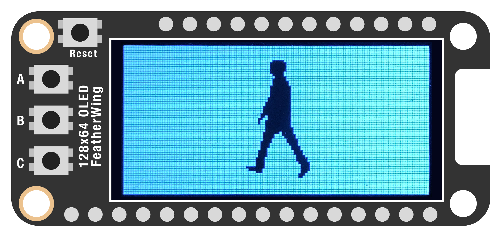
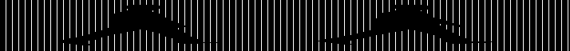

# SPRITES  

We've seen how to create shapes, load images, and even access individual pixels. For our last example, let's take a look at how we can load and display animations!

When we're done, you should end up with an animation that looks like this:



[*Sprites*](https://en.wikipedia.org/wiki/Sprite_(computer_graphics)) are a simple but very effective way of creating animations. A sprite is a single frame of an animation – for example: a person walking – which are shown one after another to create the illusion of movement. Sprites can be stored as separate images, but often all the frames are combined into a single image, called a *sprite sheet.* When loaded, the software slices up the sprite sheet into individual sprites.

***

### CONTENTS  

* [Prepare your sprite sheet](#prepare-your-sprite-sheet)  
* [Basic setup](#basic-setup)  
* [Load the sprite sheet](#load-the-sprite-sheet)  
* [Make it move!](#make-it-move)  
* [Full code example](#full-code-example)  
* [Challenges](#challenges)

### STUFF YOU'LL NEED  

* 128x64 monochrome OLED display  
* Jumper wires  
* Feather board  
* USB cable  

***

### PREPARE YOUR SPRITE SHEET  

For this example, we'll use a modified version of [this walk cycle animation](https://stock.adobe.com/hk/images/business-man-walk-cycle-sprite-sheet-animation-frames-silhouette-loop-animation/183196051). I downloaded it, moved everything around so the frames are centered, and exported it as a single BMP file. (If you need a reminder how to do that, see the [Load Images](04-LoadImages.md) example.) I've also included the tile size (the dimensions of each frame) in the filename, so we don't have to open the file and figure it out later.

The final sprite sheet looks like this:



But we can think of it as being made of 17 separate images, each 42x64 pixels.


***

### BASIC SETUP  

Before we load the sprite sheet, let's load the required libraries and set up the display:

```python
import board
import displayio
import time

import adafruit_displayio_sh1107
import adafruit_imageload

width =  128
height = 64

displayio.release_displays()
i2c = board.I2C()
display_bus = displayio.I2CDisplay(i2c, device_address=0x3C)
display = adafruit_displayio_sh1107.SH1107(
    display_bus, 
    width =    width, 
    height =   height, 
    rotation = 0
)
frame = displayio.Group()
display.show(frame)
```

And let's also change the background color:

```python
def background(color):
  bitmap =  displayio.Bitmap(width, height, 1)
  palette = displayio.Palette(1)
  palette[0] = color
  bg = displayio.TileGrid(
    bitmap,
    pixel_shader = palette,
    x = 0,
    y = 0
  )
  frame.append(bg)

background(0xFFFFFF)
```

***

### LOAD THE SPRITE SHEET  

Now we can load the sprites! Let's first define some parameters. We'll need these to properly load and animate the sprite later:

```python
sprite_filename = 'Images/WalkCycle-42x64px.bmp'
sprite_width =    42
sprite_height =   64
num_frames =      17
```

Then let's load it! Adafruit's library does a great job of simplifying this process. First we load the file:

```python
sprite_file, palette = adafruit_imageload.load(
  sprite_filename,
  bitmap = displayio.Bitmap,
  palette = displayio.Palette
)
```

Then create a variable (I'm calling this `walker` since it's someone walking) and split the main image into frames:

```python
walker = displayio.TileGrid(
  sprite_file,
  pixel_shader = palette,
  width =  1,
  height = 1,
  tile_width =  sprite_width,
  tile_height = sprite_height
)
frame.append(walker)
```

Finally, let's give our person an x/y position and a direction of movement:

```python
walker.x =  0
walker.y =  0
direction = 1
```

***

### MAKE IT MOVE!  

A static sprite is no fun, so let's animate it! Our `walker` variable contains all the frames in our sprite sheet. To make it animate, we need to update which frame is being shown every time the while-loop repeats. We can do that by creating a variable `index` and use that to determine which frame is displayed:

```python
index = 0
while True:
  # determine which frame should be displayed
  walker[0] = index
  
  # update the index for the next frame
  # if we've exceeded the number of frames,
  # loop back around
  index += 1
  if index == num_frames:
    index = 0

  time.sleep(0.05)
```

Save this to your board. You should see the character walking in place! 

> 🙋‍♀️ Why `walker[0]`? This is part of the weird way graphics are handled on these boards. In this case, the first element in `walker` is the sprite that's being displayed, with all the other ones hidden away. We tell the display which frame to show by setting `walker[0]`. Confusing for sure...

Ok! Next, let's make them walk forward. To do this, all we need to do is update the `x` position each frame, right after we update which frame is displayed:

```python
walker.x += direction
```

Nice... but the figure walks offscreen. Let's fix that:

```python
if walker.x < 0:
  walker.flip_x = False
  direction *= -1
elif walker.x > width-sprite_width:
  walker.flip_x = True
  direction *= -1
```

Two things are happening here:

1. `walker.flip_x`: this is a fantastic function built into the Adafruit library! It flips an image in the horizontal direction, changing which way the person is facing  
2. `direction *= -1`: by multiplying the direction by `–1`, it reverses the way the figure will walk

***

### FULL CODE EXAMPLE  

```python
import board
import displayio
import time

import adafruit_displayio_sh1107
import adafruit_imageload

# variables for the sprite
sprite_filename = 'WalkCycle-42x64px.bmp'
sprite_width =    42
sprite_height =   64
num_frames =      17

width =           128
height =          64

# setup the display
displayio.release_displays()
i2c = board.I2C()
display_bus = displayio.I2CDisplay(i2c, device_address=0x3C)
display = adafruit_displayio_sh1107.SH1107(
    display_bus, 
    width =    width, 
    height =   height, 
    rotation = 0
)
frame = displayio.Group()
display.show(frame)

def background(color):
  bitmap =  displayio.Bitmap(width, height, 1)
  palette = displayio.Palette(1)
  palette[0] = color
  bg = displayio.TileGrid(
    bitmap,
    pixel_shader = palette,
    x = 0,
    y = 0
  )
  frame.append(bg)

background(0xFFFFFF)

# load the sprite
sprite_file, palette = adafruit_imageload.load(
  sprite_filename,
  bitmap = displayio.Bitmap,
  palette = displayio.Palette
)
walker = displayio.TileGrid(
  sprite_file,
  pixel_shader = palette,
  width =  1,
  height = 1,
  tile_width =  sprite_width,
  tile_height = sprite_height
)
frame.append(walker)

walker.x = 0
walker.y = 0
direction = 1

# make them walk!
index = 0
while True:
  # set which frame of the animation to draw
  walker[0] = index
  
  # update which frame will be onscreen
  # next and loop if we've reached the end
  index += 1
  if index == num_frames:
    index = 0

  # move the person forward
  walker.x += direction

  # have them reverse when they hit the edges
  if walker.x < 0:
    walker.flip_x = False
    direction *= -1
    index = 10
  elif walker.x > width-sprite_width:
    walker.flip_x = True
    direction *= -1
    index = 10

  time.sleep(0.05)
```

***

### CHALLENGES  

1. Can you make the figure walk the other direction when a button is pressed?  

