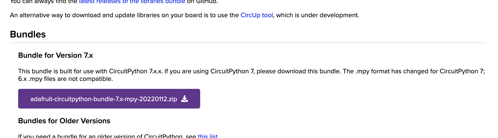

# RGB LED (aka NeoPixel)  

Most Arduino-like boards come with an LED built in, but the Feather boards have a bonus: an LED capable of changing color! Called RGB LEDs (or [NeoPixels](https://learn.adafruit.com/adafruit-neopixel-uberguide), in Adafruit-speak), we can change their color in code to make some really cool effects.

The process is very similar to the previous example, with a few additional setup steps.

**Note! If you haven't already, be sure to [update the version of Circuit Python on your board](00-SettingUpYourBoard.md) before adding the NeoPixel library.** Otherwise, they may not be compatible.

***

### CONTENTS  

* [Adding the required library](#adding-the-required-library)  
* [Connecting the LED](#connecting-the-led)  
* [Setting the color](#setting-the-color)  
* [Full code example](#full-code-example)  
* [Challenges](#challenges)  

***

### ADDING THE REQUIRED LIBRARY  
To control our RGB LED, we need to add an extra library to our project. Just like before, at the top of your code add the line:

```python
import neopixel
```

Save to your board and... an error! That's because the `neopixel` library isn't included with Circuit Python. Instead, we have to manually download and add it to our board.

Go to the [Circuit Python libraries page](https://circuitpython.org/libraries) and find the "bundle" for version `7.x`:



Don't download earlier versions, the Python source or "community" bundle, etc. Unzip the bundle, then look for:

    lib > neopixel.mpy

Copy the file to the `lib` folder on your board. That's it! Test it by trying the import statement again:

```python
import neopixel
```

When saving it to your board this time you should see no errors. If it doesn't work, make sure you copied the right file to the correct folder on your board.

> There are lots of other libraries in the bundle, mostly for interfacing with specific (and sometimes complex) sensors and hardware. Check out the `examples` folder too for demos.

***

### CONNECTING THE LED
With the `neopixel` library installed, we're ready to set up our LED. First, we import the required libraries:

```python
import board
import neopixel
import time
```

Then, similar to the built-in LED, we create a variable for our NeoPixel:

```python
led = neopixel.NeoPixel(board.NEOPIXEL, 1)
```

The `1` at the end specifies that we only have one RGB LED. If you were to hook them up externally, NeoPixels can be chained together!

Finally, we set the LED's brightness. `1` means full brightness, `0` is off, and `0.5` is half brightness:

```python
led.brightness = 0.1
```

***

### SETTING THE COLOR  
Let's make some light! The LED's color is listed as red, green, and blue (RGB) values, the color format used most commonly in computer graphics. Values range from `0` (none of that color) to `255` (100% of that color). 

For example, this changes the LED to a bright red:

```python
led.fill( (255, 0, 0) )
```

And a light blue:

```python
led.fill( (0, 150, 255) )
```

Thinking in RGB can be hard, so a color picker is a great way if you want to get a particular hue.

We can combine these commands with a while-loop and a time delay:

```python
while True:
  led.fill( (255, 0, 0) )   # red
  time.sleep(0.5)

  led.fill( (0, 255, 0) )   # blue
  time.sleep(0.5)

  led.fill( (0, 0, 255) )   # green
  time.sleep(0.5)
```
***

### FULL CODE EXAMPLE  
Copy/paste this code, save, and watch the colors change!  

```python
import board
import neopixel
import time

led = neopixel.NeoPixel(board.NEOPIXEL, 1)
led.brightness = 0.1

while True:
  led.fill( (255, 0, 0) )   # red
  time.sleep(0.5)

  led.fill( (0, 255, 0) )   # blue
  time.sleep(0.5)

  led.fill( (0, 0, 255) )   # green
  time.sleep(0.5)
```

***

### CHALLENGES  

1. Use a color picker online and set the colors to something more pleasing  
2. Try changing the LED's brightness value and see the range it's capable of. Can you make it change brightness in the while-loop instead?  

