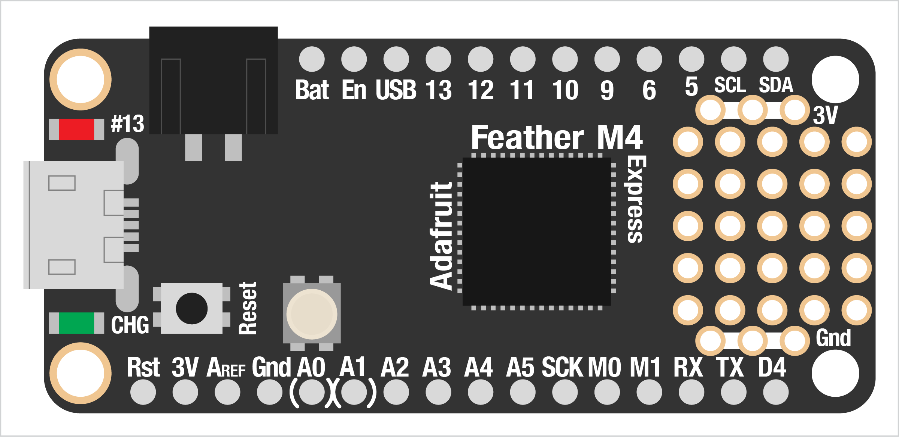
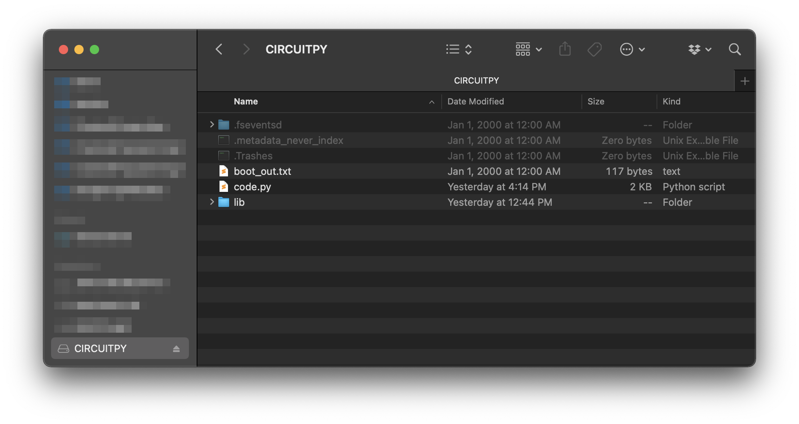
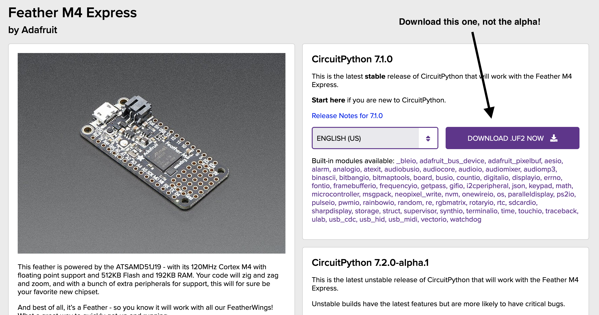
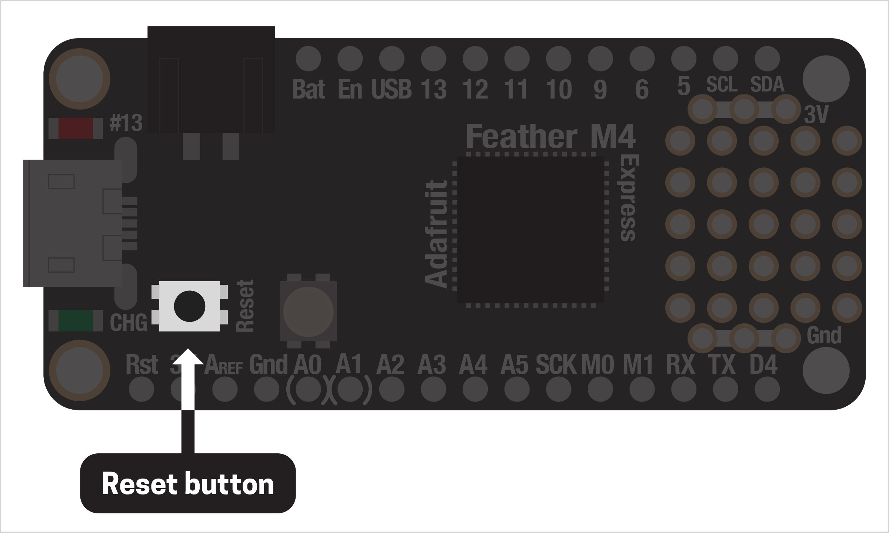
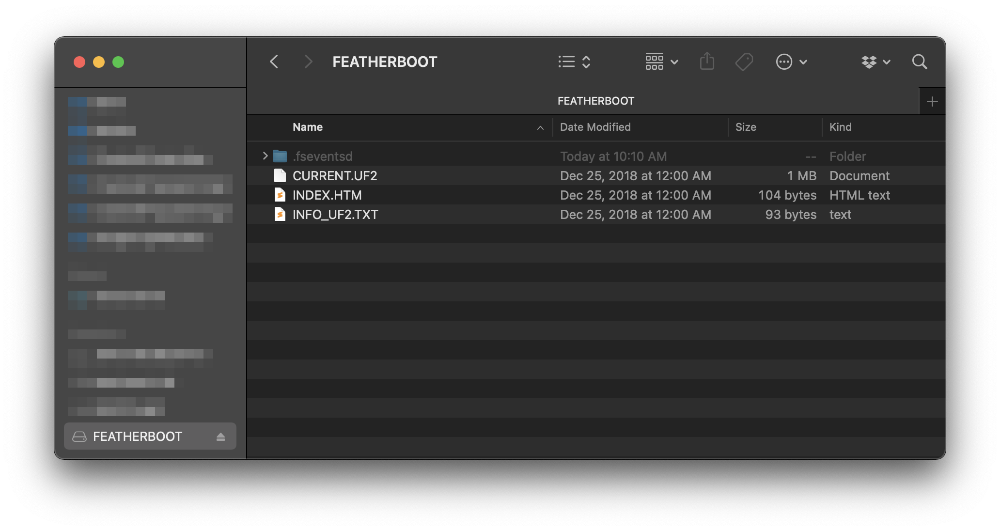

# SETTING UP YOUR BOARD

Today there are a *ton* of options if you want to use code, sensors, and electronics. Generally, these fall into two categories:

1. Microcontrollers: essentially tiny, very low-power computers that can either run on their own or connected to a computer; the most popular of these is [Arduino](https://www.arduino.cc/)  
2. Single-board computers: small, self-contained computers capable of running a full operating system, usually some version of Linux; most popular is [Raspberry Pi](https://www.raspberrypi.org/)  

While Arduino is a fantastic platform with tons of examples and a great community, it requires us to use the programming language C, which is super complex and confusing. Raspberry Pi is also wonderful, but requires a monitor and keyboard, and a lot more setup. Of course, there are lots of other options out there, ranging from single chips that cost less than a dollar to plug-and-play sensor interfaces.

These all have their place, but this semester we're going to use the [Feather M4 Express](https://www.adafruit.com/product/3857) as our microcontroller and [Circuit Python](https://circuitpython.org/) to program it, both fantastic projects from the NYC-based company Adafruit. Before we can do fun stuff with our boards, though, we have to get everything set up. 

This will involve quite a few steps but, once it's done, we won't have to do this again!

***

### CONNECT YOUR BOARD  
First, plug the Feather board into your computer with a USB cable. It should mount as a "volume" on your computer, like a USB thumb drive. If your computer asks you to connect the device as a keyboard, just exit out of the prompt (we'll cover this later). 

If the board doesn't show up, check your USB connection – often, it's just that your board isn't getting enough power:  
* Make sure you're not using a "charge-only" USB cable  
* Don't use a USB hub  
* Try another USB port on your computer  
* If none of these work, try the [Feather troubleshooting page](https://learn.adafruit.com/adafruit-feather-m4-express-atsamd51/troubleshooting) or contact Adafruit customer service: they're super responsive and very helpful  

The board's volume should be named `CIRCUITPY`. Open it up and let's look inside...

There will be three items:  
* `code.py` ← the file we'll edit to program the board  
* `lib` ← a folder for extra code libraries we might want to install  
* `boot_out.txt` ← info on the board and its firmware (more about this in a sec)  
* Any additional files, like those that appear in the image above, are "hidden" and we can just ignore them  

**When you disconnect your Feather from your computer, be sure to eject it first!** Just unplugging your board could result in permanent damage to your Feather 🤬

***

### UPDATE CIRCUIT PYTHON  
Our boards come with Circuit Python pre-installed, which is great, but it's also probably out of date already. To make sure everything works well and you can follow along with all the demos here, we should update Circuit Python first.

On your board, open up the `boot_out.txt` file. You should see text like this:  

    Adafruit CircuitPython 6.2.0 on 2021-09-14; Adafruit Feather M4 Express with samd51j19
    Board ID:feather_m4_express

The first line tells us a bunch of info, including which version of Circuit Python is installed. **The most recent version is `7.1.0`, so if your file shows anything lower you'll need to update.** Go to [the Circuit Python page for our board](https://circuitpython.org/board/feather_m4_express) and download the latest release. This should download quickly and have a `.uf2` file extension.

Your Feather board has a small reset button, right next to the USB connector. This reboots the microcontroller but can also let us enter "update" mode by double-clicking it.

After double-clicking, the board should disconnect automatically and then reconnect with a different name (probably something like `FEATHERBOOT`). Open up the new volume.

To update, just drag the downloaded `.uf2` file to the board: it will install, reboot itself, and you're all set! Check the `boot_out.txt` file again to make sure it worked.

(You may want to [check the version of the bootloader](https://learn.adafruit.com/adafruit-feather-m4-express-atsamd51/update-the-uf2-bootloader) as well, but this probably won't be necessary if you bought your board recently. The [bootloader](https://en.wikipedia.org/wiki/Bootloader) is software that handles starting up your board and running your code.)

***

### INSTALL THE MU EDITOR  
There are lots of ways we can edit code and upload it to our board. We'll look at some better (and more complicated) ways later in the semester, but for now we'll use the free [Mu Editor](https://codewith.mu/), a piece of software created by Nicholas H. Tollervey specifically for working with these kinds of boards and Circuit Python. 

Just [download the editor](https://codewith.mu/en/download) and install it on your computer! We'll look at how to connect the editor with your board and verify everything is working later.

***

That's it, now we're ready to write some code! A huge thanks to all the amazing, smart, generous folks who create these tools and give them away for free.

