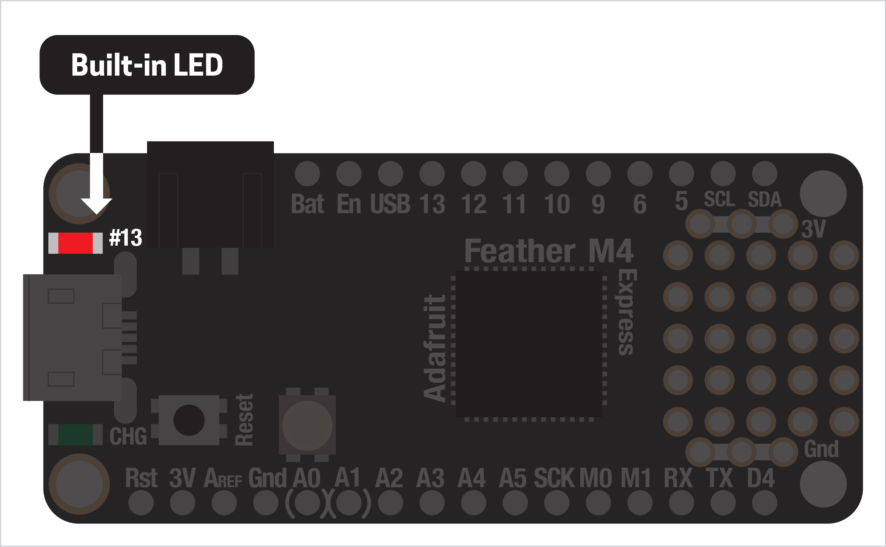
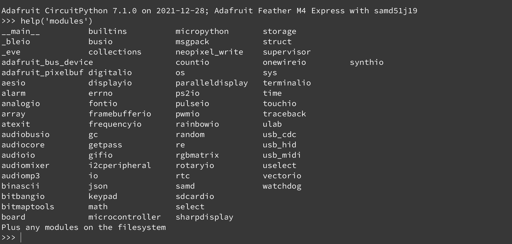

# INTERNAL LED

We'll get into sensors and circuits and all kinds of exciting stuff soon, but the physical computing equivalent of `Hello world` is blinking an LED. [Light-emmitting diodes](https://en.wikipedia.org/wiki/Light-emitting_diode) (LEDs) are everywhere: they're cheap, bright, don't require much electricity, come in lots of colors, are super easy to wire up, and are pretty hard to accidentally destroy!

For this first example, we'll use the LED that's built into your Feather board: even easier! You'll find it next to the USB connection near the label `#13`.



> 🙋‍♀️ You might have noticed there are two other LEDs on your board. One is opposite the LED we're using, next to the USB connector, and indicates battery charging (if connected). The other is an RGB LED, which we'll use in our next example!

We don't need to do anything to else to prep our board for this, just open the Mu Editor and start coding!

***

### CONTENTS  

* [Library imports](#library-imports)  
* [Set up LED](#set-up-led)  
* [Blink](#blink)  
* [Blink (forever)](#blink-forever)  
* [Full code example](#full-code-example)  
* [Challenges](#challenges)  

### STUFF YOU'LL NEED  

* Feather board  
* USB cable  

***

### LIBRARY IMPORTS  
Before we can do anything, we need to add some extra code to our project. Called *libraries* (or *modules* in Python-speak), these give us extra functionality that we might not ordinarily need, such as controlling the inputs and outputs on our board. These can technically go anywhere, but are best at the very top of your code.

The first two are specific to Circuit Python, the third is part of standard Python:

```python
import board       # access the board itself
import digitalio   # access input/output on board
import time        # utility for time-related stuff
```

You'll most likely use all three imports (or some version of them) in every project you make this semester.

**WHAT OTHER PYTHON MODULES CAN I USE?**  
Python has a ton of amazing modules built-in, but not all of them are accessible using Circuit Python. This is mostly due to the limited hardware and memory on your board.

To see a full list of modules available on your board, go to the Mu Editor and type the following command into the console...

    help('modules')

...and hit enter. You should get back a list like this:



Lots of cool stuff! You'll learn how to install additional modules to the board in the next example, too.

***

### SET UP THE LED  
In this example, we don't have to actually wire anything up. But we do have to tell our board two things: where to find the LED and that this pin should be an output.

> 🙋‍♀️ A *pin* is a connection to your Feather board and is what we soldered those connectors to! Pins can set as either an output (LEDs, motors, etc) or input (buttons like we'll use next week, sensors, etc). They can also be digital or analog, something we'll talk more about later too. [Check out this page](https://learn.adafruit.com/adafruit-feather-m4-express-atsamd51/pinouts) if you want to read about all the different pins on the board.  

First, we create a variable for our LED. We can specify a specific pin but Circuit Python gives us a shorthand for the built-in LED:

```python
led = digitalio.DigitalInOut(board.LED)
```

Then we tell our board we want to use it as an output:

```python
led.direction = digitalio.Direction.OUTPUT
```

***

### BLINK
With our LED pin set up, now we can turn it on and off!

```python
led.value = True       # turn on the LED
led.value = False      # turn it off
```

If we were to run this, we'd see the LED come on then turn off immediately. To change the timing, we can use the Python `time` library (imported in the beginning of this demo) to pause our program between turning the LED on and turning it off:

```python
led.value = True       # turn on the LED
time.sleep(0.5)        # pause the program for 1/2-sec
led.value = False      # turn it off
time.sleep(0.5)        # and pause again
```

Better, but it will only blink once then stop! We can fix that...

***

# BLINK (FOREVER)  
Instead of blinking just once, we want our program to keep blinking our LED forever until the board is shut off. To do this, we'll put our blink code in a while-loop.

```python
while True:
  led.value = True
  time.sleep(0.5)
  led.value = False
  time.sleep(0.5)
```

Since `True` is always true, the loop will keep running forever! We will almost always create a loop like this in our code, after creating variables/functions and setting up the board's pins. If you've used `p5.js` before, this is just like the `draw()` loop!

***

### FULL CODE EXAMPLE  
Let's see the whole thing in action. Copy/paste this code to your board, save it, and you should see the LED blink... awesome!

```python
import board
import digitalio
import time

led = digitalio.DigitalInOut(board.LED)
led.direction = digitalio.Direction.OUTPUT

while True:
  led.value = True
  time.sleep(0.5)
  led.value = False
  time.sleep(0.5)
```

***

### CHALLENGES  

1. Try changing the `time.sleep()` values above to see how they change the blink rate  
2. Try ejecting the board from your computer: what happens? Why do you think that happens?  

