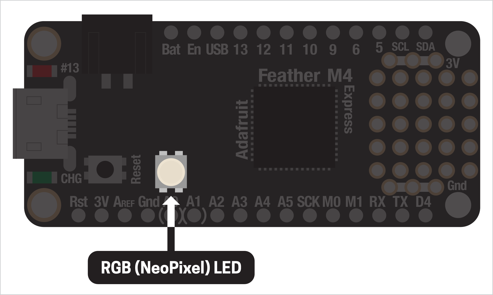
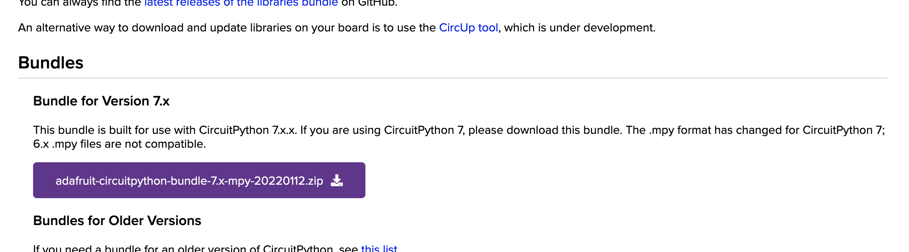

# RGB LED (aka NeoPixel)  

Most Arduino-like boards come with an LED built in, but the Feather boards have a bonus: an LED capable of changing color! Called RGB LEDs (or [NeoPixels](https://learn.adafruit.com/adafruit-neopixel-uberguide), in Adafruit-speak), we can change their color in code to make some really cool effects. You can find the RGB LED near the reset button on your board:



The process is very similar to the previous example, with a few additional setup steps, which we'll only have to do once.

***

### CONTENTS  

* [Adding the required library](#adding-the-required-library)  
* [Connecting the LED](#connecting-the-led)  
* [Setting the color](#setting-the-color)  
* [Full code example](#full-code-example)  
* [Challenges](#challenges)  

### STUFF YOU'LL NEED  

* Feather board  
* USB cable  

***

### ADDING THE REQUIRED LIBRARY  
To control our RGB LED, we need to add an extra library to our project. **Note! If you haven't already, be sure to [update the version of Circuit Python on your board](00-SettingUpYourBoard.md) before adding the NeoPixel library.** Otherwise, they may not be compatible and could cause weird errors.

Just like before, at the top of your code add the line:

```python
import neopixel
```

Save to your board and... an error! That's because the `neopixel` library isn't included with Circuit Python by default. Instead, we have to manually download and add it to our board.

Go to the [Circuit Python libraries page](https://circuitpython.org/libraries) and find the "bundle" for version `7.x`. (Don't download earlier versions, the Python source, "community" bundle, etc.)



Unzip it, then look inside for:

    lib → neopixel.mpy

Copy the file to the `lib` folder on your board by dragging it over. That's it! Test it by trying the import statement again:

```python
import neopixel
```

When saving it to your board this time you should see no errors. If it doesn't work, make sure you copied the right file to the correct folder on your board.

> 🙋‍♀️ There are lots of other libraries in the bundle, mostly for interfacing with specific (and sometimes complex) sensors and hardware. We won't use most of them, but the `examples` folder has a bunch of bonus demos you might want to check out.

***

### CONNECTING THE LED
With the `neopixel` library installed, we're ready to set up our LED. First, we import the required libraries:

```python
import board
import neopixel
import time
```

Then we create a variable for our NeoPixel. This is similar to the built-in LED, but it uses the NeoPixel library instead:

```python
led = neopixel.NeoPixel(board.NEOPIXEL, 1)
```

The `1` at the end specifies that we only have one RGB LED. If you were to hook them up externally, NeoPixels can be chained together! (For a cool example, see [these cool lightsabers](https://ziasabers.com/shop/neopixel-lightsaber/).)

Finally, we can set the LED's brightness. `1` means full brightness, `0` is off, and `0.5` is half brightness:

```python
led.brightness = 0.1
```

***

### SETTING THE COLOR  
Let's make some light! The LED's color is made of three values: red, green, and blue (RGB), the color format used most commonly in computer graphics. Values range from `0` (none of that color) to `255` (100% of that color). When combined, you can theoretically make any color, though you may find it hard to make pale or muted colors.

For example, this changes the LED to a bright red:

```python
led.fill( (255, 0, 0) )
```

And a light blue:

```python
led.fill( (0, 150, 255) )
```

Thinking in RGB can be hard, so a [color picker](https://color.adobe.com/create/color-wheel) is a great way if you want to get a particular hue. We can combine these commands with a while-loop and a time delay, cycling through three differnt colors:

```python
while True:
  led.fill( (255, 0, 0) )   # red
  time.sleep(0.5)

  led.fill( (0, 255, 0) )   # blue
  time.sleep(0.5)

  led.fill( (0, 0, 255) )   # green
  time.sleep(0.5)
```

Notice that our color values are separated by commas and are contained in parentheses. This is called a [*tuple*](https://www.w3schools.com/python/python_tuples.asp) and lets us store multiple values together. What's cool is that now we can create color variables and use them elsewhere in our program!

```python
orange = (255, 150, 0)
led.fill(orange)
```

***

### FULL CODE EXAMPLE  
Copy/paste this code, save to your board, and watch the colors change!  

```python
import board
import neopixel
import time

led = neopixel.NeoPixel(board.NEOPIXEL, 1)
led.brightness = 0.1

while True:
  led.fill( (255, 0, 0) )   # red
  time.sleep(0.5)

  led.fill( (0, 255, 0) )   # blue
  time.sleep(0.5)

  led.fill( (0, 0, 255) )   # green
  time.sleep(0.5)
```

***

### CHALLENGES  

1. Use a [color picker](https://color.adobe.com/create/color-wheel) online to find a nice set of colors that work well together. Can you change the color values above to your new values?    
2. Try changing the LED's brightness value and see the range it's capable of. Can you make it change brightness dynamically in the while-loop?  

