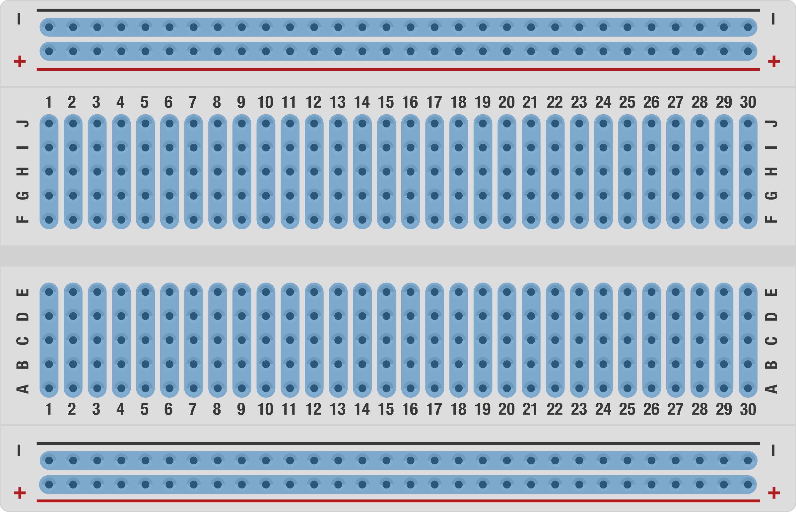
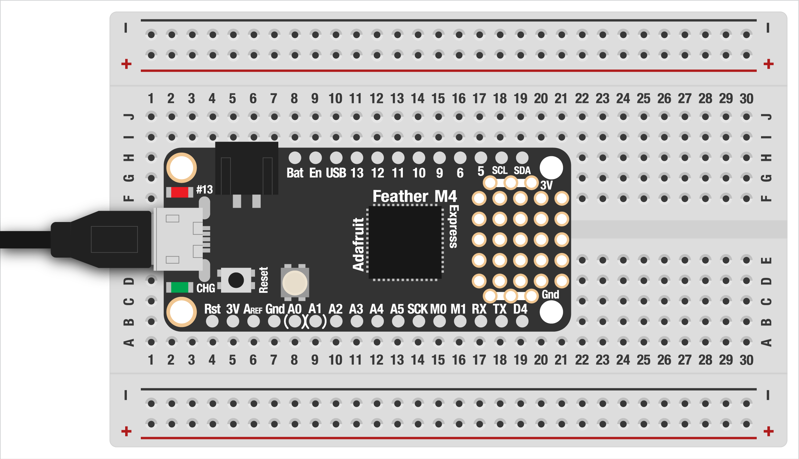
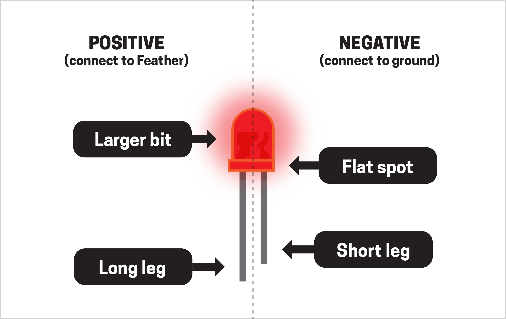
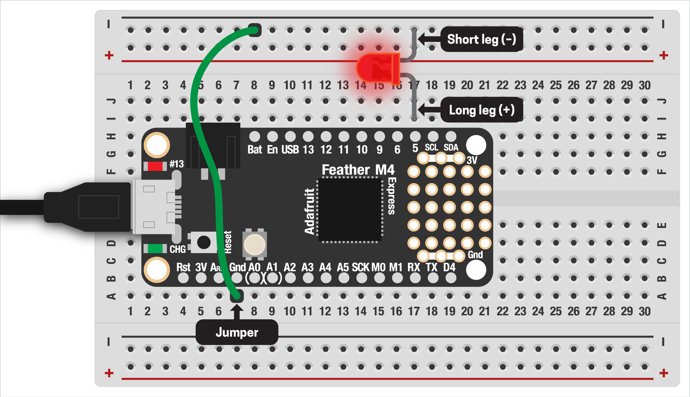

# EXTERNAL LED

The built-in LEDs on your Feather board are great for quick prototyping, but we can also hook up an external LED. (In the next example, we'll see how to hook up multiple LEDs!)

***

### CONTENTS  

* [Safety note](#%EF%B8%8F-safety-note-%EF%B8%8F)  
* [Get to know your breadboard](#get-to-know-your-breadboard)  
* [Placing your Feather board](#placing-your-feather-board)  
* [Hooking up the LED](#hooking-up-the-led)  
* [Testing the LED](#testing-the-led)  
* [Challenges](#challenges)  

### STUFF YOU'LL NEED  

* One LED  
* Breadboard  
* Jumpers  
* Feather board  
* USB cable  

***

### ☠️ SAFETY NOTE! ☠️  
Starting with this example, we'll be working directly with electricity and building circuits. While everything we're doing is pretty safe, you do risk (in order of not-so-good to really bad) damaging a part, your Feather, your computer, and electrocuting yourself.

***⚡️ Places in these tutorials where you need to be extra careful will be noted like this! ⚡️***

But don't let that scare you off! Most everything we'll be doing is quite safe and forgiving, even if you do something wrong. Just follow these directions carefully and ask if you have any questions.

***

### GET TO KNOW YOUR BREADBOARD  
This will be our first real circuit! There's lots of ways we could hook up our LED, but for this example (and most of them this semester) we'll use an electronics breadboard. This prototyping tool lets us build circuits kind of like Legos or guitar pedals, plugging in and chaining together parts easily. You can then take everything apart and reuse it for another project.

Breadboards come in various sizes and configurations, but they all have rows of holes where we can plug stuff in. Some of these holes are electrically connected to each other! This helps us hook parts together to make circuits, but it's important to know what's connected to what. 

The breadboard is divided into two sections, one for power and one for components:



**POWER**  
The top/bottom each have two long rows used for power distribution, noted as `+` and `–`. They are connected along the rows but not to each other or to their pair on the opposite side of the breadboard.

**COMPONENTS**  
The middle of the breadboard is where we'll put all our components. It's divided down the middle, with the top and bottom sections electrically separate from each other. The holes in each column (numbered, in this example) are connected to each other, but not across the middle gap or to adjacent rows.

For example, the hole at `A1` is connected to the hole at `E1`, but not `F1` or `A2`.

> 🙋‍♀️ Breadboards are great for prototypes but the connections aren't very sturdy. We'll talk more about soldering, enclosures, etc in a few weeks.

***

### PLACING YOUR FEATHER BOARD  
Now that you understand how the breadboard is laid out, we can start by placing your Feather board! The exact location isn't super important, but it should look something like this:



The result is that each pin on the Feather is connected to a column on the breadboard so we can connect parts to it, but they are electrically isolated from each other.

***

### HOOKING UP THE LED  
***⚡️ Make sure your board is unplugged from USB before continuing! ⚡️***

LEDs are pretty robust little critters and it would take some doing to burn one out. But since we'll be hooking up a (very basic) circuit, it's worth slowing down for a minute and making sure we hook this up correctly. 

Every LED has two legs, one that electricity goes into (positive) and the other where it flows back out (negative or ground). LEDs are "polarized," meaning they have to be inserted in the right direction, like a AA battery.



**POSITIVE**  
Find the longer leg of the LED and carefully insert it into the hole next to the pin labeled `D5`, near the far end of the board.

**GROUND**  
Insert the short end of the LED into any hole in the ground (`–`) row. Using a jumper wire, make a connection between the ground row and the `Gnd` pin on the board.



> 🙋‍♀️ We'll talk more about electricity, ground, voltage, etc in a few weeks. But you won't need to know much to be able to make cool stuff!

***

### TESTING THE LED  
With everything hooked up, verify one more time that it's correct then plug your Feather into USB power. Open the Mu Editor, copy/paste this code, and save it to your board:

```python
import board
import digitalio
import time

# LED connected to pin D5
led = digitalio.DigitalInOut(board.D5)
led.direction = digitalio.Direction.OUTPUT

while True:
    led.value = True
    time.sleep(0.5)
    
    led.value = False
    time.sleep(0.5)
```

You should see your LED blinking on/off: congrats, you just built your first electronic circuit! 🎉

If the LED doens't work, first check that it's installed in the right orientation. Reversing an LED is usually not going to hurt anything, but it won't work if it's plugged in backwards.

The code works just like our first internal LED example with one change: instead of `board.LED` as the pin, we specify that we'd like to use `D5` instead. Nice!

***

### CHALLENGES  

1. Can you adjust the timing of the blink by creating variables at the top of your code, one for the `on` duration and one for `off`?  
2. Can you change the circuit to use another digital output pin? (Hint: any pins on your Feather board that start with `D` should work fine; the ones marked `A1` etc are for analog input/output, which we'll cover soon.)  

