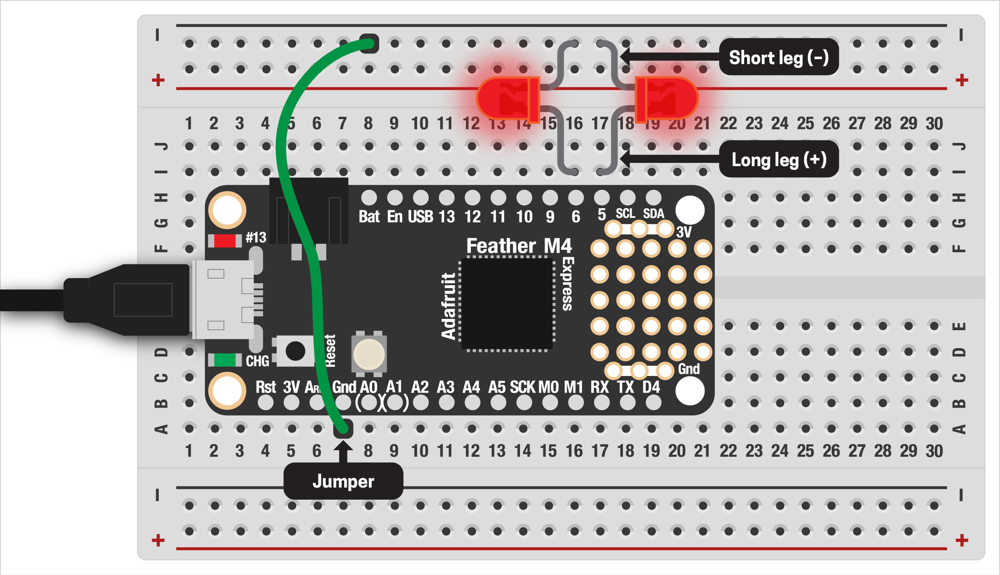

# MULTIPLE LEDs

Having added an external LED to our Feather, it's super easy to more! Be sure you've gone through and completed the [previous example](04-ExternalLED.md) first, since we'll skip through the details and just add more LEDs to that setup.

***

### CONTENTS  

* [Unplug from power!](#unplug-from-power)  
* [Wire up another LED](#wire-up-another-led)  
* [Modify the code](#modify-the-code)  
* [How many LEDs can I add?](#how-many-leds-can-i-add)  
* [Challenges](#challenges)  

### STUFF YOU'LL NEED  

* Two or more LEDs  
* Breadboard  
* Jumpers  
* Feather board  
* USB cable  

***

### UNPLUG FROM POWER!  
***⚡️ Before adding to your breadboard, you always want to disconnect everything from power first! ⚡️***

This is for your safety and the safety of your components.

***

### WIRE UP ANOTHER LED  
Adding another LED to our board is super simple: just do the same thing as the [previous example](04-ExternalLED.md):

* Plug the long leg of the LED into a hole next to another digital pin, such as `D6`  
* Plug the short end into the same ground row as the other LED, but in another hole  

When done, your breadboard should look like this:



***

### MODIFY THE CODE  
Double-check that everything is hooked up correctly, then plug your Feather into USB power again. We can then modify the previous program to add a second LED variable.

```python
import board
import digitalio
import time

# first LED connected to pin D5
led1 = digitalio.DigitalInOut(board.D5)
led1.direction = digitalio.Direction.OUTPUT

# second LED connected to pin D6
led2 = digitalio.DigitalInOut(board.D6)
led2.direction = digitalio.Direction.OUTPUT

while True:
    led1.value = True
    led2.value = False
    time.sleep(0.5)
    
    led1.value = False
    led2.value = True
    time.sleep(0.5)
```

Save the code to your board: you should see the LEDs blinking on/off in opposite patterns!

***

### HOW MANY LEDs CAN I ADD?  
At this point, you're probably asking yourself: "Woah cool, how many LEDs can I attach to this thing?" There are 13 digital pins, so theoretically we could attach 13 LEDs to the Feather. In reality though, this probably won't work. Everything you attach to your Feather draws electricity from the USB connection on your computer. USB is meant to run low-power things like a keyboard or mouse, so if we plug too many LEDs in we risk running out of juice.

> 🙋‍♀️ "Juice" in this case is something called [electrical current](https://en.wikipedia.org/wiki/Electric_current). We'll talk more about this later, but just know that asking for too much power from your computer can result in an error message or possibly damaging your Feather board. In the worst (but unlikely) case, you could damage the USB port on your computer.

TLDR: you can probably plug in about six LEDs without any problem. You can try more, but add one at a time. More than eight is most likely a bad idea. Same goes for attaching more than two LEDs to the same pin. When in doubt, ask first.

***

### CHALLENGES  

1. Can you add two more LEDs to your circuit? (Hint: be sure to update your breadboard *and* the code.)  
2. What patterns can you make with your LEDs? Can you make them run back-and-forth in a line? Count numbers?  

