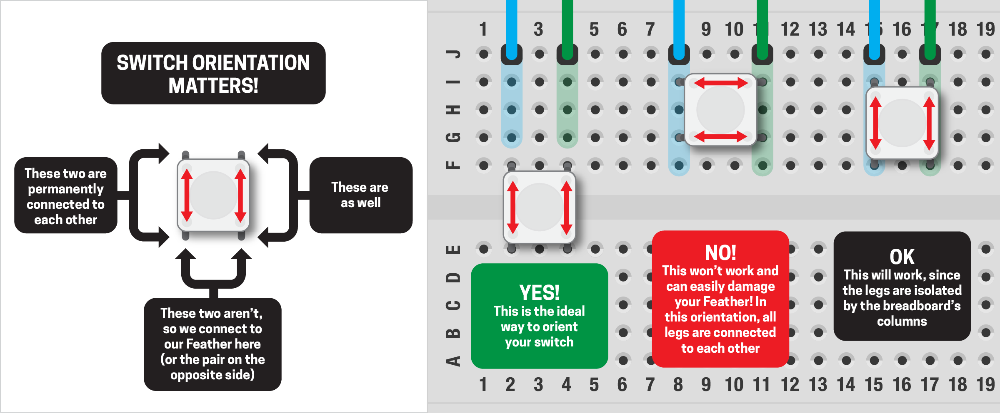
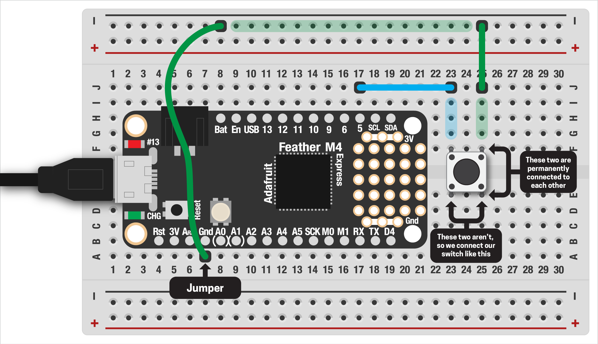

# BUTTON INPUT

Soon we'll get to fancy sensors that can read all kinds of things in the world. But before we get there, we'll start with the simplest "sensor" possible: a pushbutton! This works like an LED in reverse, reading the state of one of the digital pins on our Feather board.

***

### CONTENTS  

* [Types of buttons](#types-of-buttons)  
* [Testing the button](#testing-the-button)  
* [Why does `False` mean pressed?](#why-does-false-mean-pressed)  
* [Challenges](#challenges)

### STUFF YOU'LL NEED  

* One pushbutton  
* Jumper wires  
* Feather board  
* USB cable  

***

### TYPES OF BUTTONS  
Buttons (aka switches) come in many different forms: the small ones in your parts kit, huge ones on arcade games, tiny ones for controlling the volume of your phone... they're everywhere! We can think of buttons as having two basic types:  

* Momentary: on when you press them, off when you let go (like a key on your keyboard)  
* Latched: stays on or off, depending on their position (like a light switch at home)  

Buttons can further be defined by how they are wired, but that's more detail than we'll need at this point. If you want to read more, check out [this super-detailed article](https://www.electronicshub.org/switches/).

We're going to start with a breadboard-friendly pushbutton. This is a momentary switch and will give us `True` when it's pressed, `False` when it's not. (Actually, it's going to be the opposite, but we'll talk about why later.)

***

### HOOKING UP THE BUTTON  
***⚡️ Make sure your board is unplugged from USB before continuing! ⚡️***

We'll start by adding the Feather to your breadboard, just like last week. Then we can place our button off to the side, but we have to be sure it's connected correctly:



As you can see in the image above, the orientation of these buttons is important, as is how the legs are connected. You'll want to have your button straddle the gap in the breadboard, then attach your jumpers like this:  



One end is connected to ground, the other to digital pin #5 (`D5`) on your Feather. When the button is pressed, electricity flows through and the Feather can read the change. That's it for this circuit!

***

### TESTING THE BUTTON  
With our button wired up, all we need to do is add some code to read it. First, we import the usual libraries:

```python
import board 
import digitalio
import time
```

Then we create a variable for our button. The first line is just like our LEDs last week:

```python
button = digitalio.DigitalInOut(board.D5)
button.pull = digitalio.Pull.UP
```

> 🙋‍♀️ What's that second line for? It's 100% required, but we'll talk more about what's happening there in the next section.

Then we can read the state of our button (whether it's pressed or not) in a loop:

```python
while True:
  print(button.value)
  time.sleep(0.05)
```

The `time.sleep()` is there to prevent overloading the console in Mu Editor, which might happen if we bombard it with data too quickly. We'll see this throughout upcoming examples.

Upload this code to your board and see if it works. You should see the values in the console change as you press the button!

***

### WHY DOES `FALSE` MEAN PRESSED?  
You'll notice that the Feather prints `True` when the button is *not* pressed and `False` when it is... the opposite of what we'd intuitively expect. Super weird. The reason has to do with how our button is wired.

We haven't talked too much about how electricity works yet, but you never want power from the board to flow directly to ground. This is called a ["short circuit"](https://en.wikipedia.org/wiki/Short_circuit). Like a downed power line, a short on your breadboard can lead to errors or damaging your Feather – bad news! As our circuit is currently set up, when the switch is pressed power would flow from `D5` to ground, creating a short circuit.

To avoid this, we need an extra part called a ["resistor"](https://en.wikipedia.org/wiki/Resistor). Like its name implies, a resistor resists, or impedes, the flow of electricity. By adding a resistor to the circuit, a bit of the electricity gets dissipated as heat on its way to ground and prevents a short circuit. (More on resistors later.)

Lucky for us though, our Feather board has a tiny resistor built in to each digital pin! To enable that resistor, we added `button.pull = digitalio.Pull.UP` right after creating the input variable. This works great and means we don't have to buy any extra parts, but does change the way electricity flows in our circuit. This leads to the button values being opposite what we'd expect, but is a reasonable tradeoff, given we don't have to add any extra parts.

> 🙋‍♀️ Don't worry if this feels confusing! We don't have to know too much about how electricity or circuits work to be able to make awsome stuff. Just keep in mind that we can't have power running directly to ground and to use an internal resistor when connecting a button.

***

### CONNECTING TO THE LED  
Printing some text every time a button is pressed is pretty boring. Let's hook it up to the internal LED on our board! We'll skip over the details (that was covered last week, if you need a refresher). First, we create an LED variable:

```python
led = digitalio.DigitalInOut(board.LED)
led.direction = digitalio.Direction.OUTPUT
```

Then, in our loop, we can read the state of the button and apply that to our LED:  

```python
while True:
  led.value = button.value
```

Great, but backwards from what we'd expect. That's because (as discussed above) the button will read `False` when pressed and `True` when not! To fix this, we need an if-statement:  

```python
while True:
  # if button is pressed, turn on LED
  if button.value == False:
    led.value = True

  # otherwise, turn it off
  else:
    led.value = False
```

Pretty neat! You may see examples that do the same thing in a more concise way, using the `not` operator:

```python
while True:
  led.value = not button.value
```

The `not` command flips boolean values: when the button is `False` the LED is `True` and vice versa! In most of our examples, we'll use the longer version because it's easier to understand for beginners.

***

### FULL CODE EXAMPLE  
Let's put this all together:

```python
import board 
import digitalio

# create a button on digital pin #5
# with an internal resistor enabled
button = digitalio.DigitalInOut(board.D5)
button.pull = digitalio.Pull.UP

# led setup
led = digitalio.DigitalInOut(board.LED)
led.direction = digitalio.Direction.OUTPUT

while True:
  # if button is pressed, turn on LED
  if button.value == False:
    led.value = True

  # otherwise, turn it off
  else:
    led.value = False
```

***

### CHALLENGES  
1. Can you make the LED blink in a pattern while the button is pressed, then turn off when it's released?  

