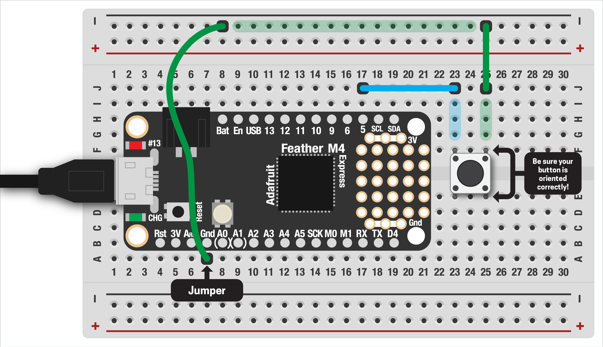

# BUTTON STATE CHANGE

In our last example, you might have noticed that the console prints `False` over and over while the button is pressed. That's because our loop reads the button's state (pressed or not) repeatedly as fast as possible. If the button is still pressed, it prints `False` again.

But what if we only want to know when state of the button has changed, gone from `True` to `False` or vise versa? We'll code this by hand then, in the next example, see how we can improve this with an idea called *debouncing.*

***

### CONTENTS  

* [Setup](#setup)  
* [Keeping track of the button's state](#keeping-track-of-the-buttons-state)  
* [Full code example](#full-code-example)  
* [Challenges](#challenges)  

### STUFF YOU'LL NEED  

* One pushbutton  
* Jumper wires  
* Feather board  
* USB cable  

***

### SETUP  
If you don't already have a button on your breadboard, get that hooked up first:



This is the same button setup as the [previous example](00-SingleButton.md), so you can check back on that if you need a refresher. We'll also add the basic button code from before:

```python
import board 
import digitalio
import time

# create a button on digital pin #5
# with an internal resistor enabled
button = digitalio.DigitalInOut(board.D5)
button.pull = digitalio.Pull.UP

while True:
  print(button.value)
  time.sleep(0.05)
```

If you run this, you should see a long series of `True` and `False` printing, depending on the state of the button.

***

### KEEPING TRACK OF THE BUTTON'S STATE  
With our basic setup ready, now we can figure out a way to keep track of the button's state. First, we need a variable to store the last reading of the button:

```python
prev_state = True
```

The initial value here isn't too important, but we can safely assume the button won't be pressed when the Feather starts up. **Remember that the Feather will read `False` when the button is pressed and `True` when it's not!**

Now we can read our button and compare the current state to the previous one. If they are different (not equal) we know that the button has either been pressed or released:

```python
current_state = button.value
if current_state != prev_state:
    print('state changed!')
```

However, this on it's own doesn't work since the `prev_state` value never changes. To fix this, whenever the button's state changes, we store the current state to compare to future readings. The new if-statement looks like this:

```python
current_state = button.value
if current_state != prev_state:
    print('state changed!')
    prev_state = current_state
```

Try running it and see the difference! We'll cover another way to do this in the next example, and how to use the state change to trigger an event.

***

### FULL CODE EXAMPLE  
Copy/paste this code, save to your board:

```python
import board 
import digitalio

# create a button on digital pin #5
# with an internal resistor enabled
button = digitalio.DigitalInOut(board.D5)
button.pull = digitalio.Pull.UP

# keep track of the previous button state
prev_state = True

while True:
  # read the current state of the button
  current_state = button.value

  # compare to previous state
  # if not the same, print some text
  # and store the current state
  if current_state != prev_state:
    print('state changed!')
    prev_state = current_state
```

***

### CHALLENGES  

1. Can you have your code print something different when the button is pressed vs released? (Hint: you'll need another if-statement inside the current one)  
2. We'll cover this in the next demo, but can you think of a way to have the LED flash a pattern when the button is pressed but not when it's released?  
