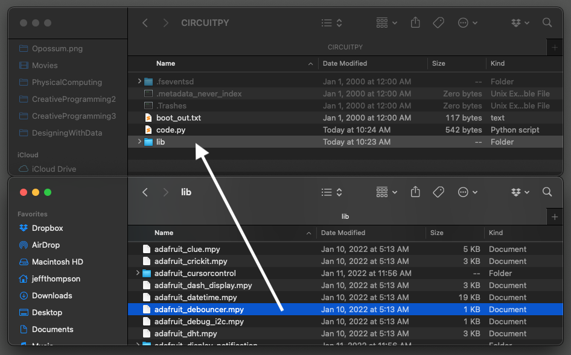

# DEBOUNCING  
Computers, phones, and all of our electronics make it really easy to forget that they are made of physical stuff! And all that messy, "real" stuff doesn't always behave in the same clean and perfect way that code does. Luckily, we can clean up this messy input with some clever code.

***

### CONTENTS  

* [Why do we need debouncing?](#why-do-we-need-debouncing)  
* [Setup](#setup)  
* [Add the `Debouncing` library](#add-the-debouncing-library)  
* [Debouncing](#debouncing)  
* [Triggering events](#triggering-events)  
* [Full code example](#full-code-example)  
* [Challenges](#challenges)  

### STUFF YOU'LL NEED  

* One pushbutton  
* Jumper wires  
* Feather board  
* USB cable  

***

### WHY DO WE NEED DEBOUNCING?  
If you were to [zoom inside your button](Images/ButtonInternalMechanism.gif), you'd see two metals bits that touch each other when the button is pressed. Being made of physical materials, there's a moment right before the button is pressed where its state is unpredictable: you might see the button's state bouncing back and forth between pressed and not!

  
*An [oscilloscope](https://learn.sparkfun.com/tutorials/how-to-use-an-oscilloscope/all), showing a button's state bouncing when pressed (via [Adafruit](https://learn.adafruit.com/make-it-switch/debouncing))*

To avoid this, we can improve our previous state change code by introducing something called *debouncing.* This basically ignores any inputs after the state of the button has changed for a short period of time. Users won't notice a difference but this can be really helpful in stabilizing the behavior of your project.

We could code this by hand (and that would be a great challenge!) but lucky for us Circuit Python has built in debouncing code!

***

### SETUP  
We'll use the same setup and code as the [previous example](01-ButtonStateChange.md)... easy!

***

### ADD THE DEBOUNCING LIBRARY  
Circuit Python has a wonderful code library to handle debouncing for us, but it's not included by default. Like last week and the NeoPixel code, we have to copy this to our Feather board's `lib` folder: just drag it to your board!



If you need a refresher or lost the Circuit Python libraries you downloaded, [check out the demo from last week](https://github.com/jeffThompson/PhysicalComputing/blob/master/Week02_LEDs/Demos/03-RGB_LED.md#adding-the-required-library).

***

### DEBOUNCING  
With our button set up and debouncing library added, we first want to import the library:

```python
from adafruit_debouncer import Debouncer
```

This import syntax is a little different than we've seen before. It only brings in the part of the debouncing library that we need. We don't have to do it this way, but it helps keep our code cleaner.

Next, we create a variable for the debounced button. This is pretty similar to a normal button, but in two steps: first we create the pin the button is attached to, then create a button variable with that pin.

```python
pin = digitalio.DigitalInOut(board.D5)
pin.pull = digitalio.Pull.UP
button = Debouncer(pin)
```

The library will now handle everything for us, watching the current and previous state of the button! We can update our while-loop to read the button's state:

```python
while True:
  # get the current state of the button
  button.update()

  # if the button went from low to high
  if button.fell:
    print('pressed!')

  # if the button went from high to low
  if button.rose:
    print('released!')
```

Way easier than the state change code! Circuit Python keeps track of the button's previous state for us and handles (behind the scenes) a process of ignoring inputs after the state of the button changes for a short period.

> 🙋‍♀️ What do `rose` and `fell` mean? In physical computing, we often refer to `True` as `high` and `False` as `low` &larr; we could also think of this as `1` and `0`, electricity and no electricity. This means the state of our button is *rising* when it goes from low to high and *falling* when it goes from high to low!

***

### TRIGGERING EVENTS  
This debounce stuff is great, but just printing some text isn't that fun. Let's modify our while-loop to play a pattern using the built-in LED when the button is pressed. First, we'll add the LED to our code:

```python
led = digitalio.DigitalInOut(board.LED)
led.direction = digitalio.Direction.OUTPUT
```

Then we can create a sequence for the LED to display. There's a lot of cool things we could do here, but I used an [online Morse code translator](https://morsecode.world/international/translator.html) to encode the word "hello":

    .... . .-.. .-.. ---

This pattern is made up of three parts: short pulses, long pulses, and blanks between letters. To make updating our code easier, let's define a variable for the duration of each part at the top of our code. The [official Morse Code specification](https://skybrary.aero/articles/morse-code) says that our pulses can be any duration, but the long should be three times the duration of the short:

```python
short_dur = 0.1 
long_dur =  0.3
pause_dur = 0.3
```

With that done, we could just [hard-code](https://en.wikipedia.org/wiki/Hard_coding) the pattern in our if-statement but it would get really messy. Instead, let's first make a custom function:

```python
def pulse(dur, off_time=0.1):
  # turns on the LED for a certain amount
  # of time, turns it off and pauses
  led.value = True
  time.sleep(dur)
  led.value = False
  time.sleep(off_time)
``` 

This function turns on the LED for a specified period of time, then turns it off for another period of time before it will allow another pulse. Nice!

Let's use that to play the "hello" sequence:

```python
if button.fell:
  # if the button is pressed, play "hello" in
  # morse code
  pulse(short_dur)  # h
  pulse(short_dur)
  pulse(short_dur)
  pulse(short_dur)
  pulse(pause_dur)  # (space)
  pulse(short_dur)  # e
  pulse(pause_dur)  # (space)
  pulse(short_dur)  # l
  pulse(long_dur)
  pulse(short_dur)
  pulse(short_dur)
  pulse(pause_dur)  # (space)
  pulse(short_dur)  # l
  pulse(long_dur)
  pulse(short_dur)
  pulse(short_dur)
  pulse(pause_dur)  # (space)
  puslse(long_dur)  # o
  puslse(long_dur)
  puslse(long_dur)
    
```

Not the most efficient code but it works. When you press the button, you should see this pattern play. A better system would probably be a set of functions that take a string of text as the input and does everything for us, but I'll leave that for you to try!

> 🙋‍♀️ What happens when you release the button? You'll notice that the pattern doesn't stop right away. That's because of the way the function (and Python) works: it will play every pulse until stopping. Only when it's done will the loop continue and the button's state is read again. We could check the button's state in our function and stop (using `return`) if the state is low, which would be especially helpful for long sequences. See if you can try adding that yourself!

***

### FULL CODE EXAMPLE  
Copy/paste this code, save to your board:  

```python
import board 
import digitalio
import time
from adafruit_debouncer import Debouncer

# morse code timing (in seconds)
short_dur = 0.1 
long_dur =  0.3
pause_dur = 0.3

# create a button on digital pin #5
# with an internal resistor enabled
pin = digitalio.DigitalInOut(board.D5)
pin.pull = digitalio.Pull.UP

# create the debouncer and have it
# watch our button
button = Debouncer(pin)

# use the built-in LED
led = digitalio.DigitalInOut(board.LED)
led.direction = digitalio.Direction.OUTPUT

def pulse(dur, off_time=0.1):
  # turns on the LED for a certain amount
  # of time, turns it off and pauses
  led.value = True
  time.sleep(dur)
  led.value = False
  time.sleep(off_time)

while True:
  # get the current state of the button
  button.update()

  # if the button went from on to off
  if button.fell:
    print('pressed!')

  # if the button went from off to on
  if button.rose:
    print('released!')

    # play "hello" in morse code
    pulse(short_dur)  # h
    pulse(short_dur)
    pulse(short_dur)
    pulse(short_dur)
    pulse(pause_dur)  # (space)
    pulse(short_dur)  # e
    pulse(pause_dur)  # (space)
    pulse(short_dur)  # l
    pulse(long_dur)
    pulse(short_dur)
    pulse(short_dur)
    pulse(pause_dur)  # (space)
    pulse(short_dur)  # l
    pulse(long_dur)
    pulse(short_dur)
    pulse(short_dur)
    pulse(pause_dur)  # (space)
    puslse(long_dur)  # o
    puslse(long_dur)
    puslse(long_dur)
```

***

### CHALLENGES  

1. Can you have the LED display the word "bye" when the button is released?  
2. Can you improve our Morse Code function to be easier to use? One way might be to pass in `.`, `-`, or `[space]` and have it automatically pick the right duration.  

