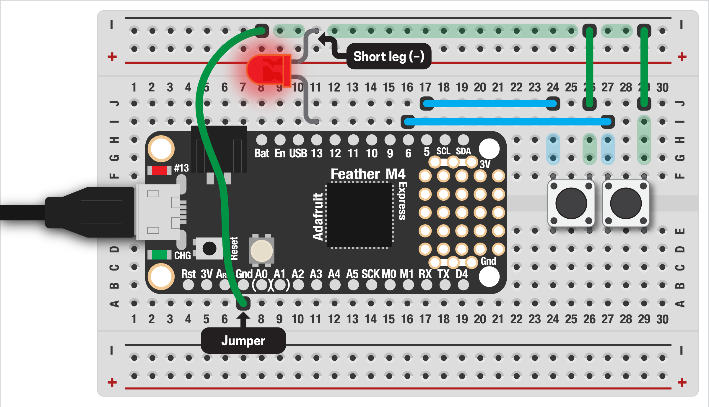

# MULTIPLE BUTTONS  

Just like LEDs, one button is cool but not as much fun as lots of buttons! There are lots of ways we could accomplish this, but in this example we'll leverage custom functions as a way to clean up and simplify repeated tasks in our code, then have an LED blink different patterns depending on which button is pressed.

***

### CONTENTS  

* [Wiring the buttons and LED](#wiring-the-buttons-and-led)  
* [Button variables](#button-variables)  
* [Reading the buttons](#reading-the-buttons)  
* [Full code example](#full-code-example)  
* [Challenges](#challenges)  

### STUFF YOU'LL NEED  

* Two (or more) pushbuttons  
* One LED (or the internal one)  
* Jumper wires  
* Feather board  
* USB cable  

***

### WIRING THE BUTTONS AND LED  
To set up our board, we'll add a second button. This gets wired up just like the single button, with one end connected to ground and the other to a digital pin, in this case `D6`:



Add an LED from `D13` as well, just like in the image above. We can set up the LED in code too:

```python
led = digitalio.DigitalInOut(board.D13)
led.direction = digitalio.Direction.OUTPUT
```

***

### BUTTON VARIABLES  
With everything ready, can now create variables for our buttons. We could do this just like our previous example, creating a second set of variables for the new pin and button:

```python
pin1 = digitalio.DigitalInOut(board.D5)
pin1.pull = digitalio.Pull.UP 
button1 = Debouncer(pin1)

pin2 = digitalio.DigitalInOut(board.D6)
pin2.pull = digitalio.Pull.UP 
button2 = Debouncer(pin2)
```

This works, but as you can see, if we wanted more than two buttons it's going to get really messy! Looking closely at our code, we can see that all three lines needed to create a button are exactly the same, just with different input pins. This kind of generalization is a perfect opportunity for a function:

```python
def button_setup(pin):
  # create a button input
  # (with pullup resistor and debouncing)
  button = digitalio.DigitalInOut(pin)
  button.pull = digitalio.Pull.UP 
  return Debouncer(button)
```

This takes in the pin we want to use and sets it up for us, then sends back the button ready for debouncing. Let's add a button on pins `D5` and `D6` using our new function:  

```python
b1 = button_setup(board.D5)
b2 = button_setup(board.D6)
```

***

### READING THE BUTTONS  
Now we're ready to read our buttons! This works just like one button, but we'll need to call `update()` to get the state of each one:

```python
b1.update()
b2.update()
```

Now let's have the LED blink once if the first button is pressed, twice if the second one is pressed. Again, this is a great place to use a function: we can pass in the number of blinks.

```python
def blink(n, duration=0.2):
  # blinks an LED a specified number of times
  for i in range(0, n):
    led.value = True
    time.sleep(duration)
    led.value = False
    time.sleep(duration)
```

With this function done, we can trigger it when the button's state is `falling` (pressed):  

```python
if b1.fell:
  blink(1)
if b2.fell:
  blink(2)
```

You should see the LED blink once when the first button is pressed, twice when the second one is pressed!

***

### FULL CODE EXAMPLE  
Copy/paste this code, save to your board:

```python
import board 
import digitalio
import time
from adafruit_debouncer import Debouncer

# LED setup
led = digitalio.DigitalInOut(board.D13)
led.direction = digitalio.Direction.OUTPUT

def button_setup(pin):
  # creates a button input
  # (with pullup resistor and debouncing)
  button = digitalio.DigitalInOut(pin)
  button.pull = digitalio.Pull.UP 
  return Debouncer(button)

# create the two buttons using our function
b1 = button_setup(board.D5)
b2 = button_setup(board.D6)

def blink(n, duration=0.2):
  # blinks an LED a specified number of times
  for i in range(0, n):
    led.value = True
    time.sleep(duration)
    led.value = False
    time.sleep(duration)

while True:
  # get the current button state
  b1.update()
  b2.update()
  
  # if falling (pressed), blink the LED
  if b1.fell:
    blink(1)
  if b2.fell:
    blink(2)
```

***

### CHALLENGES  

1. Can you add a third button and have it blink the LED three times?  
2. Could you add a second LED as well? Can you have one button blink one of the LEDs, the other button blink the other one?  
3. Can you make this into a simple adding machine? Using a global `total`, can you have one button add one to that number, the other two, then blink the result?  
4. This [super-helpful list of examples](https://github.com/todbot/circuitpython-tricks#set-up-and-debounce-a-list-of-pins) from Tod Kurt includes a method for debouncing multiple pins. Can you try implementing that here?  

