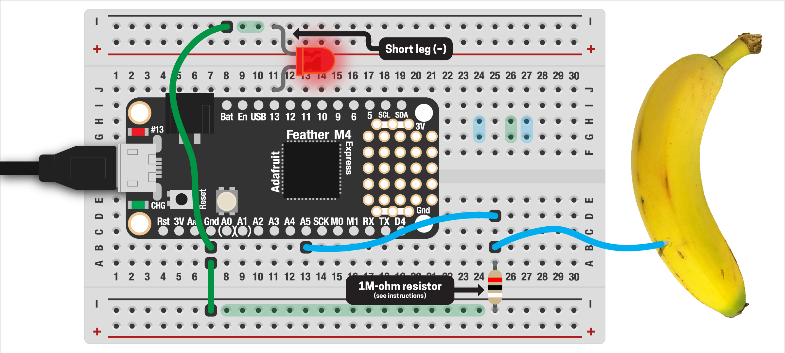
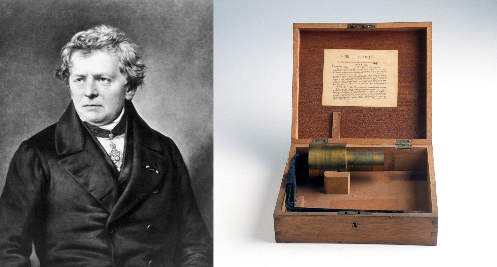

# CAPACITIVE TOUCH  

Mechanical buttons are by far the most common type, but today we're also very used to touch-sensitive devices, like the screens of our phones. This works through a technology called [*capacitive sensing*](https://en.wikipedia.org/wiki/Capacitive_sensing). Essentially, your finger changes the conductive field around the button, which we can read as an input.

> 🧐 If your phone has run out of battery, you might have noticed in the past few years that the mechanical "home" button has been replaced by a touch-sensitive one! This allows companies to include fingerprint sensors and other items under the home button – something that would have been difficult or impossible with a traditional mechanical switch. Then they use a vibration motor to simulate the feel of a real switch!

This is also similar to how the touchscreen on your phone works too. While we won't be able to do anything as fancy as read fingerprints or get `x/y` coordinates, this opens up a ton of options for us: we can even turn everyday objects like fruit or sculpted pieces into buttons!

***

### CONTENTS  

* [Wiring things up](#wiring-things-up)  
* [Reading touch input](#reading-touch-input)  
* [Resistors](#resistors)  
* [Trigger objects](#trigger-objects)  
* [Calibrating](#calibrating)  
* [Full code example](#full-code-example)  
* [Bonus code (pressure sensitivity)](#bonus-code)  
* [Challenges](#challenges)  

### STUFF YOU'LL NEED  

* Jumper wire or [alligator clip](https://www.adafruit.com/product/321)  
* 1M-ohm resistor (I'll give you one)  
* Feather board  
* USB cable  
* Optional: an object to use as a sensor  

***

### WIRING THINGS UP  
Lucky for us, the Feather has capacitive touch input built right in, making this super easy! 



First, we need a piece of wire to act as our sensor. This can be a jumper, a bit of hookup wire, or an alligator clip. Connect one end to analog pin `A5`, leaving the other end unconnected. For now, we can just use a bare wire but we'll experiment with other objects (like bananas!) shortly.

> 🙋‍♀️ Which pins can read touch input? All the analog ones! (These are marked `A0` through `A5`. More about this in the next assignment.)

Next, we need a 1 mega-ohm resistor. One end gets connected to the analog pin, the other to ground. This provides protection from a short-circuit, like discussed in the other button examples. Skipping this probably won't damage your Feather but the board is smart enough to know if you've skipped it and will throw an error until you add one.

Finally, we'll also add an LED (or use the built-in one) to see the output. 

***

### RESISTORS  
Perhaps the simplest electronic component is the resistor. We used the internal resistor with pushbuttons, but what are they? Like the name suggests, resistors [*resist the flow of electricity*](https://en.wikipedia.org/wiki/Electrical_resistance_and_conductance). All objects have some amount of resistance: think about copper which has very low resistance (meaning it conducts electricity very well, which is why it's used for wiring in your home) versus rubber, which has very high resistance (it barely conducts at all). In electronic circuits, resistors are little hotdog-shaped parts made using special materials chosen for their resistance.

Since resistors impede the flow of electricity, we talk about their *impedance*. This is measured in a unit called *ohms* (Ω), named after [Georg Ohm](https://en.wikipedia.org/wiki/Georg_Ohm), who carried out many important experiments with electricity in the early 1800s. The impedance of normal resistors varies from very small (just a few ohms) to ordinary (1k to 100k &larr; "k" meaning thousand) to fairly high (1M+ &larr; "M" meaning million), though they are made into the *petaohms*... a quadrillion ohms!


*Georg Ohm and a [British Association Standard Ohm resistor](https://www.gettyimages.com/detail/news-photo/british-association-standard-ohm-resistor-purchased-by-the-news-photo/90737541) from 1865*

The impedance of a resistor can be found two ways: either reading the [colored bands](https://www.digikey.com/en/resources/conversion-calculators/conversion-calculator-resistor-color-code) printed on it or using a multimeter. These codes can be hard to read, especially if you're color-blind! An auto-ranging multimeter will automatically read the value of the resistor for you and is by far my preferred method. (We'll try this in class.)

As we saw earlier, resistors are not polarized, meaning you can insert them in any orientation and they will work the same. This isn't the case for most other components!

Resistors are super cheap and having some on hand is really helpful. Sparkfun sells a [small kit of 500 various resistors](https://www.sparkfun.com/products/10969) for $8; Digikey has a [nice one for $45](https://www.digikey.com/en/products/detail/nte-electronics-inc/RK-02/11649734) that includes a storage case.

***

### READING TOUCH INPUT  
With our circuit wired up, we can read the touch input with code! First, we'll import the usual libraries as well as the built in `touchio` library. (This is included as part of Circuit Python, no need to add it to your board.)

```python
import board
import digitalio
import touchio
```

Then we create a touch input on analog pin `A5`. This is similar to regular buttons but even easier:

```python
touch = touchio.TouchIn(board.A5)
```

Finally, we can read the input in our while-loop:

```python
while True:
  if touch.value:
    print('Touched!')
```

The console will now print the word `Touched!` every time you touch the wire: awesome! We can also make the touch sensor light up the LED.

***

### TRIGGER OBJECTS  
A bare wire is fine, but other objects work too! Here are some suggestions – if you find something cool, please let me know and we can add to this list.

* Fruit or veggies  
* Forks, spoons, etc  
* Aluminum foil  
* Copper or aluminum tape on objects\*  
* Liquids  
* Anything else metallic  
* Insulating materials, like rubber, probably won't work  

\*Spreading copper/aluminum tape out across a larger surface not only creates a largef trigger pad, but can even read *through* the back-side of objects! Thin plywood, plastic, or fabric work great for this and allow you to hide your sensor. And of course you could cut the tape into different shapes to make unusual buttons.

***

### CALIBRATING  
Our sensor works great, but there's a few more things we can do to ensure it works best for your application.

**SWITCHING TRIGGER OBJECTS**  
If you switch the object being used to trigger the input, you'll want to restart your Feather. You can do this by pressing the reset button or by pressing `Control + d` in the Mu Editor. When the Feather starts up, it calibrates the touch library to whatever is connected, so a new object won't read properly if you add it while the Feather is running.

**ADJUST THE THRESHOLD**  
By looking at the [Circuit Python reference](https://circuitpython.readthedocs.io/en/latest/shared-bindings/touchio/index.html) for the `touchio` library, we discover additional function that may improve our sensor! There's lots there, but most promising is the `threshold` value, which sets the sensitivity of the input. 

The values allowed aren't super clear from the docs and will likely vary depending on your object. Luckily, `touchio` lets us read the raw sensor value, which will give us a good starting point:

```python
while True:
  print(touch.raw_value)
  time.sleep(0.05)
```

Using a ripe banana, I get values of about `350` when not being touched and `1300` when touched. The sensor works great with the automatic threshold, but we can try changing and see if things work better. The docs suggest setting the threshold to about `100` more than what we see from the raw input:

```python
touch = touchio.TouchIn(board.A5)
touch.threshold = 1400
```

In my case, that was not sensitive enough but may be worth adjusting as needed, depending on what you're using.

**(APPROXIMATE) PRESSURE SENSITIVITY**  
This one is a pretty cool hack! If you watch the raw value from the sensor while touching it very carefully, you will see the numbers get larger the harder you press. We can hack this to give us very approximate pressure sensitivity.

First, record the lightest and hardest touch you expect using `touch.raw_input` like above: with a bare wire, I get about `300` and `1000`. We can combine that with our pulse-width modulation code from last time to dim the LED, depending on how hard we're pressing! (To see this in action, see the `Bonus code` section below.)

***

### FULL CODE EXAMPLE  
Copy/paste this code, save to your board:

```python
import board
import digitalio
import touchio

# create touch input on analog pin #5
touch = touchio.TouchIn(board.A5)

# LED, to show up when touched
led = digitalio.DigitalInOut(board.D13)
led.direction = digitalio.Direction.OUTPUT

while True:
  # read touch sensor, if touched
  # light up the LED
  if touch.value:
    led.value = True
  else:
    led.value = False
```

***

### BONUS CODE  
This example reads the min/max `raw_value` from the sensor to do kinda-fake pressure sensitivity:

```python
import board
import touchio
import pwmio

# raw values, measured from the sensor first
min_touch = 300
max_touch = 1000

# create touch input on analog pin #5
touch = touchio.TouchIn(board.A5)

# LED, set up for PWM
led = pwmio.PWMOut(
  board.LED, 
  frequency=5000, 
  duty_cycle=0
)

def constrain(val, min_val, max_val):
  # keeps numbers within a specified range
  return min(max_val, max(min_val, val))

def scale_pwm(n, in_min, in_max, out_min=0, out_max=65535):
  # scales values into Feather M4 PWM range
  val = (((n - in_min) * (out_max - out_min)) / (in_max - in_min)) + out_min
  return int(val)

while True:
  # if above the threshold for being a touch
  if touch.raw_value >= min_touch:
    # make sure values are in the expected range
    brightness = constrain(touch.raw_value, min_touch, max_touch)
    
    # then scale the reading to PWM range and light up LED
    brightness = scale_pwm(brightness, min_touch,max_touch)
    led.duty_cycle = brightness
  
  # otherwise, turn off LED
  else:
    led.duty_cycle = 0
```

### CHALLENGES  

1. Can you add two (or more) additional touch sensors?  
2. Combining inputs can lead to interesting interface designs. Can you add a regular pushbutton and only read the touch sensor when it's pressed?  

