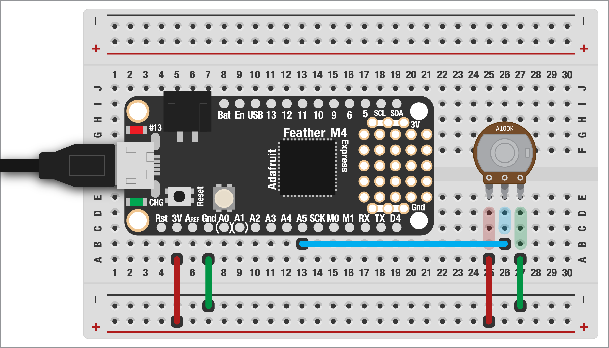

# POTENTIOMETER

We can buy all kinds of fancy analog sensors, but the humble potentiometer (aka a *knob* or *pot*) is not only super useful in projects, it's also really easy to use! I like using them to control parameters in a project without having to go into code, such as controlling the brightness of an indicator LED, the speed of a motor, etc.

***

### CONTENTS  

* [What is a potentiometer](#what-is-a-potentiometer)  
* [Analog pins](#analog-pins)  
* [Basic setup](#basic-setup)  
* [Controlling an LED](#controlling-an-led)  
* [Full code example](#full-code-example)  
* [Challenges](#challenges)

### STUFF YOU'LL NEED  

* Potentiometer  
* LED (optional)  
* Jumper wires  
* Feather board  
* USB cable  

***

### WHAT IS A POTENTIOMETER?  
A [potentiometer](https://en.wikipedia.org/wiki/Potentiometer) is really just a variable resistor! Pots come in a range of values, such as 10k- or 100k-ohms. But, because of the way we'll be using them, all resistance values will work the same so we don't have to worry about this! Any pot should work for what we're up to.

Pots also come in a variety of physical formats:  
* "Normal": like the ones in your kit, which are intended to be mounted via the threaded part to an enclosure  
* Slide: a pot in linear form, like those used in an audio mixer  
* Trim: tiny little ones, usually soldered onto a circuit board and used for adjusting things  

Lastly, pots can have two different resistance curves: *linear* and *logarithmic* (aka *audio*). If we have our pot controlling the brightness of an LED, the different tapers will affect the way that LED changes in brightness as the knob is turned. This is hard to explain verbally, but can perhaps be better seen in this chart:  


*Image via [EEPower](https://eepower.com/resistor-guide/resistor-types/potentiometer-taper/#), which also includes a table showing the marking codes used to note different pot tapers*

The linear taper increases at the exact same rate as the knob is turned. The logarithmic taper starts off slowly, then increases quickly. This gives a nice even ramp to volume or brightness control.

***

### ANALOG PINS  
So far, we've used the digital pins on our Feather for connecting buttons and LEDs. However, our boards also have six *analog* pins, marked with `A0–A5`.


Instead of measuring just on/off states, these pins give us a variable reading depending on how much electricity is being sent to them! This lets us read all kinds of sensors, as we'll see in a bit.

> 🙋‍♀️ But isn't everything inside a computer digital? Yes! The electricity coming into the analog pins needs to be converted to digital values by the Feather. This is called an *analog to digital converter* or ADC. The same thing happens with the microphone on your computer!

***

### BASIC SETUP  
Wiring up our pot is super easy, especially if we use ones designed to fit in a breadboard. The outer legs get connected to `3.3V` and `GND` (either orientation is fine), and the center leg should be connected to an analog pin.



Optionally, for this example you can add an LED on `D13` though we can also just use the built-in LED too.

***

### READING VALUES FROM THE POT  
With everything wired up, now we're ready for some code! First, we import the usual libraries (including support for PWM on our LED):

```python
import board
import time
import pwmio
```

Let's set up the LED on pin `D13`:  

```python
led = pwmio.PWMOut(
  board.LED,
  frequency=5000,
  duty_cycle=0
)
```

To read out pot, we need to import one more library. This one is built in, so no need to add any files to your board.

```python
import analogio
```

Setting up the pin for our knob works just like a digital button:

```python
knob = analogio.AnalogIn(board.A5)
```

That's it! Now we can read the values from the pot in our loop:

```python
while True:
  value = knob.value
  print(value)
  time.sleep(0.02)
```

Try turning the knob and see the values that print onscreen! You probably notice two things. The first is that the values are between `0–65535`. That range should ring a bell: it's the same as the range of [PWM values for adjusting the brightness of an LED](https://github.com/jeffThompson/PhysicalComputing/blob/master/Week02_LEDs/Demos/06-FadingWithPWM.md). This will come in handy in the next step!

The other thing you might notice is that the numbers go up when you turn the knob one way and down in the other direction. We're used to clockwise being higher and counter-clockwise being lower, like a volume control knob. But what if it's backwards?! Luckily, the fix is incredibly easy: swap the `3.3V` and `GND` pins and *voila*! The knob now changes values in the opposite direction.

***

### CONTROLLING AN LED  
With the basic pot code ready, let's use it to do something. We saw above that the values coming in from the analog pin are in the same range as PWM output, making it really easy to use the pot to dim an LED.

We already created a PWM pin for the LED, so all we need to do is add a line of code to our loop:

```python
while True:
  value = knob.value
  print(value)

  # fade the LED with the knob
  led.duty_cycle = int(value)

  time.sleep(0.02)
```

So easy! We do have to convert the knob's reading from a *float* (number with a decimal place) to an *integer* (whole number), since that's what the PWM library requires. Try it out and you should see the LED go from completely off to full brightness as you turn the knob!

***

### FULL CODE EXAMPLE  

```python
import board
import time
import pwmio

# LED on D13 (same as the built-in one)
led = pwmio.PWMOut(
  board.LED,
  frequency=5000,
  duty_cycle=0
)

# pot connected to A5
import analogio
knob = analogio.AnalogIn(board.A5)

while True:
  # read the value of the knob
  value = knob.value
  print(value)

  # fade the LED with the knob
  led.duty_cycle = int(value)

  # small delay to keep from overloading
  # the serial console with data
  time.sleep(0.02)
```

***

### CHALLENGES  

1. Can you connect a second pot and LED?  
2. Can you use the knob to control the rate of blinking of an LED? (Hint: you'll need to scale the values to a more usable range)  

