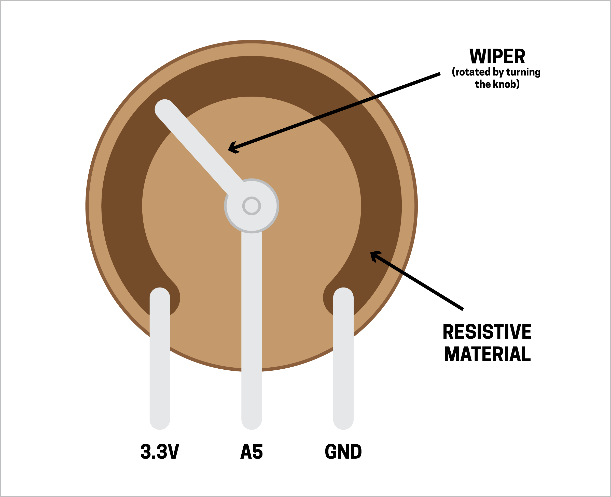
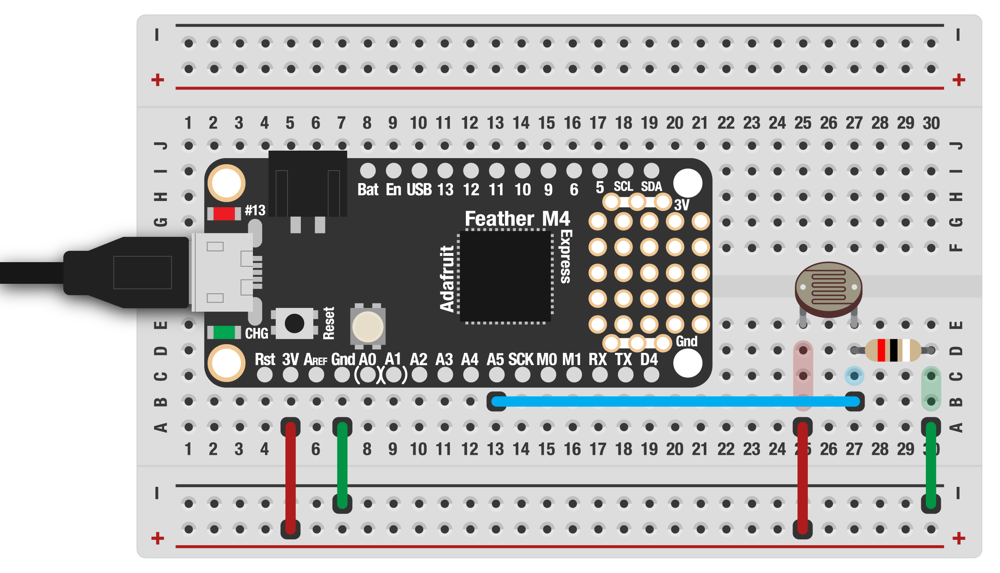

# LIGHT-DEPENDENT RESISTORS (LDRs)

Potentiometers are super easy, so let's try another analog sensor! Light-dependent resistors (LDRs) are basically little solar cells. Their resistance changes depending on the intensity of light falling on them, just like when you turn a knob.

To use an LDR, we'll need a few extra steps, but the ideas covered here will apply to lots of other analog sensors.

***

### CONTENTS  

* [Voltage divider](#voltage-divider)  
* [Measuring LDR resistance](#measuring-ldr-resistance)  
* [Picking a resistor (the easy way)](#picking-a-resistor-the-easy-way)  
* [Testing it out](#testing-it-out)  
* [Tuning our code](#tuning-our-code)  
* [Full code example](#full-code-example)  
* [Changing blink rate](#changing-blink-rate)  
* [Challenges](#challenges)

### STUFF YOU'LL NEED  

* LDR  
* Resistor (value will vary)
* Jumper wires  
* Feather board  
* USB cable  

***

### VOLTAGE DIVIDER  

In the last example, we saw how to read the analog value from a potentiometer. It was super easy but LDRs (and many other analog sensors) will require some measuring, a bit of math, and a resistor.

Let's think back to the potentiometer for a minute. The left leg is connected to `3.3V` and the right to `GND`. The center leg is connected to an analog pin and the voltage on that leg changes as we rotate the knob. To understand how this works (and what we're going to do next) it will be helpful to see what's happening inside a pot:



As you can see, the center leg is connected to the *wiper* of the pot. This connects to a ring made of a resistive material such as graphite, plastic impregnated with carbon, or a ceramic. As the knob turns, the wiper connects to the ring in a different location, changing the amount of that material the electricity flows through to the middle pin! Whatever electricity doesn't flow through to the center leg goes to ground, completing the circuit.

This splitting is called a [*voltage divider*](https://learn.sparkfun.com/tutorials/voltage-dividers) and is a key concept for working with analog sensors! Here's our potentiometer drawn as a *schematic*, a symbolic way of drawing circuits:


Those little zig-zags are the symbol for a resistor. You'll notice there are two here, one on either side of the pin we read from. But our LDR only has two legs – how will that work?!

For many analog sensors, we'll need to add a second resistor (`R2` in the schematic) to complete the voltage divider circuit. But we can't use any old resistor value: instead, we need to pick one that will give us the best range of readings.

***

### MEASURING LDR RESISTANCE  

Our first step in this process is measure the resistance of the LDR under different conditions. To do this, we'll use a multimeter. Connect the leads from the multimeter to both legs on the LDR (orientation doesn't matter). Write down the resistance you get when the LDR is covered, under normal light, and under bright light. Your phone's flashlight is great for this. For mine, I get the following values:

| CONDITION | RESISTANCE |
| --------- | ---------- |
| Dark      | 5k-ohm     |
| Normal    | 1k-ohm     |
| Bright    | 100-ohm    |

You'll notice the values jump around a bit. That's ok, approximations will work just fine.

***

### PICKING A RESISTOR (THE EASY WAY)  

With the light readings in hand, we now can figure out the best choice for the second resistor. Let's update the schematic above to show the LDR:


`R1` (resistor #1) is the LDR and `R2` is the resistor value we need to calculate. We can do some fancy math, but the easiest way is to pick a value in the middle of the low and high readings of the sensor!

    R2 = (R1 low + R1 high) / 2

From the readings we did earlier, that gives us:

    R2 = (100 ohms + 5000 ohms) / 2 ≅ 2500 ohms

Resistors don't come in every value and total accuracy isn't critical here: looking in the resistor assortment we have 2.2k-ohm and 2.7k-ohm, both of which would work.

***

### TESTING IT OUT  

With our resistor value in hand, let's wire this up and try it out! First, hook up your breadboard like this. Remember that resistors (and LDRs) aren't polarized, so you can insert them in any orientation.



Now let's add some code to read the LDR! This is just like the potentiometer example, but simplified a bit:

```python
import board
import time
import analogio

ldr = analogio.AnalogIn(board.A5)

while True:
  value = ldr.value
  print(value)
  time.sleep(0.02)
```

Use your finger to cover the sensor and/or a flashlight and see the values. They should go up when in the dark and down when exposed to light!

This is the quick-and-dirty, easy way! If you're interested in more of the theory behind this and a formula you can use to calculate `R2`, check out [this article from Sparkfun](https://learn.sparkfun.com/tutorials/voltage-dividers). It includes a calculator and lots more info, but our method should work well enough for our purposes!

***

### TUNING OUR CODE  

Let's put this new knowledge to work! Like in our previous example, let's say we want to dim an LED using the LDR. Perhaps we're building a device with a power indicator, which we want to be nice and bright in the daytime but dim to be less obnoxious at night.

We can add in the LED code from the last example:

```python
import pwmio
led = pwmio.PWMOut(
  board.LED,
  frequency=5000,
  duty_cycle=0
)
```

But if we just use the `ldr.value`, we won't get the full range of brightness. That's because, however carefully we selected the resistor, we're never going to get values exactly from `0–65535`.

To fix this, first let's add the actual readings to our table:

| CONDITION | RESISTANCE | READING |
| --------- | ---------- | ------- |
| Dark      | 5k-ohm     | 57000   |
| Normal    | 1k-ohm     | 34000   |
| Bright    | 100 ohm    | 3500    |

That means the range we can expect is `3500–57000`. We can use a function to shift the actual readings to the range for PWM output. First, we'll need the `scale()` function:

```python
def scale(n, in_min, in_max, out_min, out_max):
  val = (((n - in_min) * (out_max - out_min)) / (in_max - in_min)) + out_min
  return val
```

This takes values from one range and outputs them to another, in our case the range for PWM. Now we can modify the loop to read the LDR, scale the reading, and change the LED's brightness:

```python
while True:
  value = ldr.value
  
  # scale to pwm range
  brightness = scale(value, 57000,3500, 0,65535)

  led.duty_cycle = int(brightness)
```

> 🙋‍♀️ Why are the low/high values reversed in `scale_pwm()`? In our case, we want the LED to be at its brightest when the ambient light is strong and darkest when the ambient light is low. If we didn't reverse those values, we'd have the opposite!

This might work just fine, but there's a possibility that the values we get back from `scale_pwm()` might be outside the acceptable range for PWM. To prevent this (and an error that would halt our code), we can add a function that constrains this number to a set range:

```python
def constrain(val, min_val, max_val):
  return min(max_val, max(min_val, val))
```

We can add that to the loop, first scaling then constraining the reading before sending to the LED:

```python
while True:
  value = ldr.value
  
  # scale/constrain to pwm range
  brightness = scale(value, 3500,57000, 0,65535)
  brightness = constrain(brightness, 0,65535)

  led.duty_cycle = int(brightness)
```

***

### FULL CODE EXAMPLE  

```python
import board
import time
import pwmio
import analogio

# ldr on analog pin 5
ldr = analogio.AnalogIn(board.A5)

# built-in LED
led = pwmio.PWMOut(
  board.LED,
  frequency=5000,
  duty_cycle=0
)

# scale values from one range to another
def scale(n, in_min, in_max, out_min, out_max):
  val = (((n - in_min) * (out_max - out_min)) / (in_max - in_min)) + out_min
  return val

# keep numbers within range
def constrain(val, min_val, max_val):
  return min(max_val, max(min_val, val))

while True:
  # read the sensor value
  value = ldr.value

  # scale/constrain to pwm range
  brightness = scale(value, 57000,3500, 0,65535)
  brightness = constrain(brightness, 0,65535)
  print(value, brightness)

  # set LED
  led.duty_cycle = int(brightness)

  time.sleep(0.02)
```

***

### CHANGING BLINK RATE  

We've seen lots of examples so far that adjust the LED brightness, but what about something else? Let's try changing the rate of blink for an LED instead.

We can keep everything the same, just change our loop code:

```python
import board
import time
import pwmio
import analogio

# ldr on analog pin 5
ldr = analogio.AnalogIn(board.A5)

# built-in LED
led = pwmio.PWMOut(
  board.LED,
  frequency=5000,
  duty_cycle=0
)

# scale values from one range to another
def scale(n, in_min, in_max, out_min, out_max):
  val = (((n - in_min) * (out_max - out_min)) / (in_max - in_min)) + out_min
  return val

# keep numbers within range
def constrain(val, min_val, max_val):
  return min(max_val, max(min_val, val))

while True:
  # read the sensor value
  value = ldr.value

  # scale/constrain to blink interval (seconds)
  interval = scale(value, 57000,3500, 0.5,0.01)
  interval = constrain(interval, 0.01,0.5)
  print(value, interval)

  # set LED
  led.duty_cycle = 65535
  time.sleep(interval)
  led.duty_cycle = 0
  time.sleep(interval)

  time.sleep(0.02)
```

As the light gets brighter, the flashing should be faster!

***

### CHALLENGES  

1. What other things can you map the LDR sensor readings to?  
2. The blink code isn't ideal: since `time.sleep()` pauses our entire program, the speed can't update until a full on/off blink is finished. Can you create a timer to blink without pausing the program? (Hint: use `time.monotonic()`)

**BONUS MEGA-CHALLENGE!**  
With a bit more math, we can actually read the voltage coming into our Feather from the LDR!

```python
voltage = (ldr.value * 3.3) / 65536
```

That means, if we know the value of `R2`, we can reverse engineer the resistance we're getting. We can make our own multimeter! ...Sort of. The main limitations here are the reliability of the `3.3V` coming from the Feather and the accuracy of `R2`. Multimeters use expensive components to ensure the readings are accurate. But, as a mega-challenge, can you make this work?

(Hint: be sure to read the value of `R2` with a good quality multimeter and maybe verify the `3.3V` supply too.)

