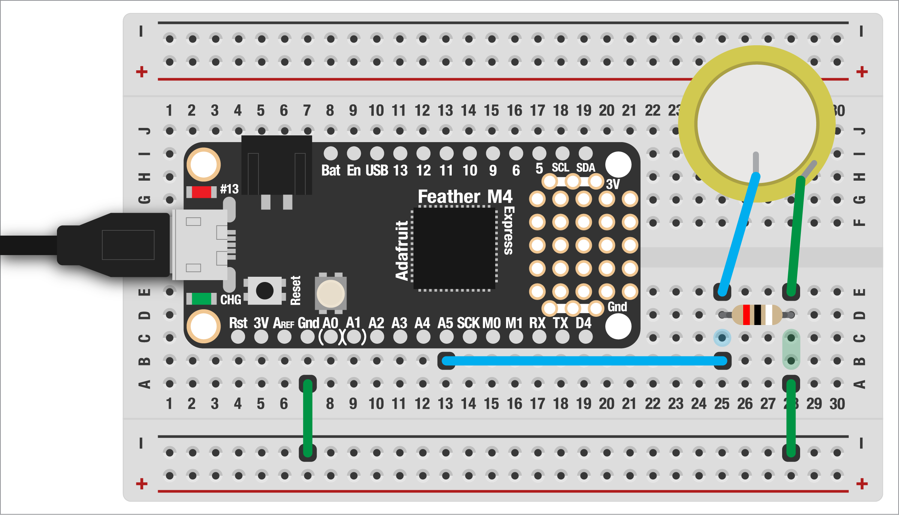

# PIEZO "KNOCK" SENSOR  

Many of the analog sensors we're using take advantage of the special properties of certain materials. A really fun, super cheap example of this is a piezo disc. These are [normally used as speakers](https://en.wikipedia.org/wiki/Piezoelectric_speaker) in inexpensive electronics such as toys, but we can also used them with the Feather too! We'll reverse them, turning these little brass-and-ceramic discs into vibration or "knock" sensors.

This example is based on a [demo by David Cuartielles/Tom Igoe](https://docs.arduino.cc/built-in-examples/sensors/Knock).

***

### CONTENTS  

* [What is a piezo disc?](#what-is-a-piezo-disc)  
* [Wiring it up](#wiring-it-up)  
* [Reading the piezo](#reading-the-piezo)  
* [Other uses for piezo discs](#other-uses-for-piezo-discs)  
* [Full code example](#full-code-example)  
* [Challenges](#challenges)

### STUFF YOU'LL NEED  

* Piezo disc  
* 1M-ohm resistor  
* Jumper wires  
* Feather board  
* USB cable  

***

### WHAT IS A PIEZO DISC?  

A piezo is made of two parts: a copper disc and a ceramic coating. The coating is [piezoelectric](https://en.wikipedia.org/wiki/Piezoelectricity), meaning it will generate electricity when deformed and deform when subjected to electricity! The "deformation" here is microscopic. As we'll see, these devices are super sensitive and tapping on the table will cause an input to the Feather. It's the tiny vibrations from the surface that are causing this signal.

  

*A diagram, showing how (in a highly-exaggerated way) that deforming the disc creates electricity, via [Wikipedia](https://en.wikipedia.org/wiki/Piezoelectric_speaker#/media/File:PiezoBendingPrinciple.svg).* 

Other materials exhibit piezoelectricity, including crystals and even bones and DNA! Amber was an ancient source of piezoelectricity, leading to the Greek name *piezein elektron*, or *squeeze/press* and *amber*. You can [grow your own piezo](http://materiability.com/piezoelectric-crystals/) crystals at home using cream of tartar and baking soda! I've had mixed results but it's super fun.

***

### WIRING IT UP  
To use our piezo disc as a sensor, we'll need a 1M-ohm resistor. This prevents the output from being too high and damaging our Feather board's analog input. This is placed in *parallel* with the piezo, meaning it goes across the two wires. This is different than in *series*, where the resistor would be in line with one of the wires.



The piezo will work best when firmly attached to a surface. For now, just taping it to the table will work fine, but you can also experiment with glueing it down or embedding it in an object. Hot glue won't work very well, though, since it's thick and flexible, which will dampen the vibrations.

***

### READING THE PIEZO  

With everything wired up, let's read the sensor. We can start with the usual setup, including the piezo on pin `A5`.

```python
import board
import time
import analogio

piezo = analogio.AnalogIn(board.A5)

while True:
  value = piezo.value
  print( (value,) )
  time.sleep(0.02)
```

Save it to the board and turn on the plotter. You should see the sensor is basically stable, but if you tap in the table you should see a spike! Let's add an LED so we can turn it on if the surface is tapped:

```python
import digitalio
led = digitalio.DigitalInOut(board.LED)
led.direction = digitalio.Direction.OUTPUT
```

Like with the LDR, you will want to see the average values you're getting with your piezo and surface. We can use that value to set a threshold, turning on the LED when the sensor's value is above that threshold.

```python
threshold = 800
```

Then, in the loop, let's toggle the LED:

```python
while True:
  value = piezo.value
  print( (value,) )

  if value >= threshold:
    led.value = True
  else:
    led.value = False

  time.sleep(0.02)
```

Try your sensor again: you should see the LED come on briefly when you hit the table hard enough!

***

### OTHER USES FOR PIEZO DISCS  
Piezo discs have lots of other uses, but there are two you might find useful in this context. The first is as a speaker. Combined with the `pulseio` or `simpleio` libraries, you can generate [low-fi chiptune-like](https://en.wikipedia.org/wiki/Chiptune) audio really easily! [Adafruit has a great tutorial](https://learn.adafruit.com/using-piezo-buzzers-with-circuitpython-arduino/circuitpython) to get you started.

Another really fun use for piezos is as contact microphones. This works the same way as our sensor (though you don't need the resistor), just add a 1/4" jack and plug it into a guitar amp! Unlike a normal mic, contact mics only pick up surface vibrations, not sound from the air. They're great for getting really tiny, near-silent sounds that would otherwise be impossible. The same idea is used for making acoustic guitar pickups.

**⚠️ Be careful! Contact mics are bonkers loud: like way louder than you can imagine! Turn your amp all the way down before plugging them in.**

Piezo technology is also used to drive inkjet printer heads and for ultra-tiny probing of single atoms in microscopes!

***

### FULL CODE EXAMPLE  

```python
import board
import time
import analogio
import digitalio

# above this, turn on the LED
# (this value will vary depending on your
# piezo and the object it's attached to)
threshold = 800

# piezo wired to A5
piezo = analogio.AnalogIn(board.A5)

# built-in LED
led = digitalio.DigitalInOut(board.LED)
led.direction = digitalio.Direction.OUTPUT

while True:
  # read the value and plot it
  value = piezo.value
  print( (value,) )

  # if above the threshold, turn
  # on the LED!
  if value >= threshold:
    led.value = True
  else:
    led.value = False

  time.sleep(0.02)

```
***

### CHALLENGES  

1. Experiment with different objects and see how the sensor responds. Do you notice that certain materials are better than others? Can you put the sensor under an object, like a tabeltop, and still get it to work?  
2. Similar to other examples we've looked at, can you add a potentiometer to tune the threshold (ie sensitivity) of the sensor, so you don't have to adjust it in code?  

