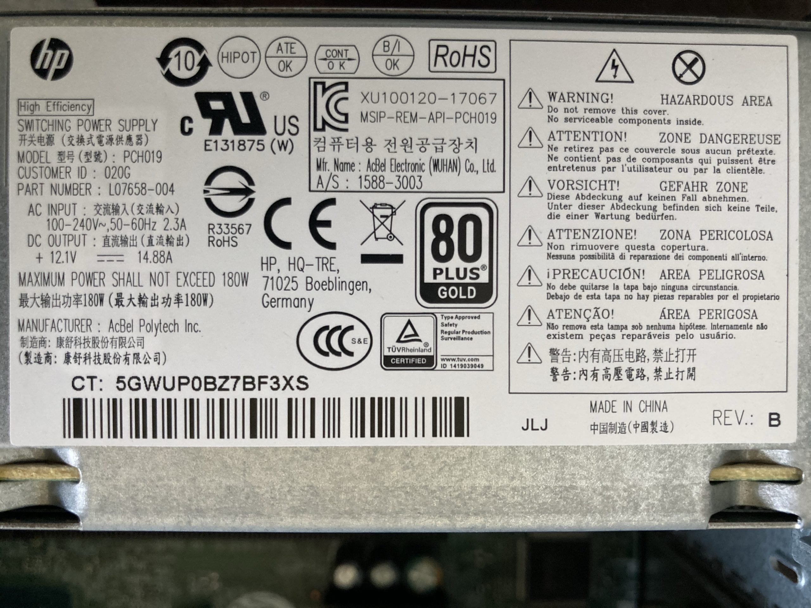

# WHAT IS ELECTRICITY?  

Jump ahead to the info you need...  
* [Electricity and circuits](#electricity-and-circuits)  
* [Voltage](#voltage)  
* [Current](#current)  
* [Power](#power)  
* [Selecting a power supply](#selecting-a-power-supply)  
* [Learning more](#learning-more)  

***

If we think beyond LEDs, sensors, microcontrollers, and code, physical computing is really all about electricity. But other than knowing it does useful stuff and maybe getting zapped from time to time by a sweater in the winter, we can't see or touch electricity. This, coupled with the fact that electricity and circuits are also super complex and mathy subjects, can make it really hard to understand.

> Robert Moog, the famous electronic instrument inventor, talks about how he could feel the flow of electricity through a circuit by looking at it. Needless to say, he was an amazing and highly unusual person!

Lucky for us, some knowledge this subject will be helpful but we don't have to go too deep. When talking about electricity, there are two main terms that we need to understand: *voltage* and *current*. Often, these different aspects of electricity are described using the metaphor of water pipes, but that doesn't always make sense. Instead, we'll focus here on the basic terms and how they relate to the kinds of things we're making.

***

### ELECTRICITY AND CIRCUITS
"What is electricity?" is a suuuper complicated question and can be answered a bunch of different ways, depending on what field you're in. For our purposes, we can think of electricity as the flow of electrons through a conductive material, like a piece of copper wire. That's an ultra-simiplified answer, but just about all we need! (If you want to read more, a good place to start is the [Wikipedia article](https://en.wikipedia.org/wiki/Electricity).)

A circuit is what happens when we put that flow of electrons to work, a lot like the way a water wheel on a river can power a sawmill! The different parts of a circuit modify that flow in different ways, resulting in everything from lightbulbs to guitar amps to computers.

The other requirement for a circuit is that the electricity be able to flow in, do some work, and then flow back out. While it's a simplification, we can think of electricity as flowing from positive, like the `3.3V` pin on our Feather, to negative, like the `GND` pin. (Though technically it's the reverse!) However, we never want electricity to just go straight from positive to negative: that would result in a short circuit, which can damage your board!

***

### AC/DC  
No, not the band. Broadly, the electricity we use comes in two forms: [alternating current](https://en.wikipedia.org/wiki/Alternating_current) (AC) and [direct current](https://en.wikipedia.org/wiki/Direct_current) (DC). Computers and the kinds of circuits we'll be making this semester all run on DC power, so we won't talk about this topic much. AC power is what comes out of the wall socket; it flips back-and-forth in the wire, going from positive to negative and back again. In the United States, this happens 60 times per second. AC on it's own isn't dangerous but the power coming from the wall is, so we'll leave that alone!

On the other hand, DC flows continuously in one direction. We find DC power in almost all consumer electronics, especially things like computers and phones. DC can be dangerous, but we'll only be working in ranges that are relatively safe.

> As the United States was starting to run electricity to people's homes, a huge debate over AC/DC raged in the late 1880s and into the 1890s. This lead to the ["current wars"](https://en.wikipedia.org/wiki/War_of_the_currents), mostly spurred by Thomas Edison and George Westinghouse. This, and Nicola Tesla's amazing (and sometimes scary) experiments in NYC make for some wild stories about the early days of electricity!

The big plastic brick attached to the power cable for your laptop or the little one for charging your phone are AC/DC adapters: these convert AC power from the wall into DC power we can use. (More on selecting power supplies below.)

***

### VOLTAGE  
The most common term you'll hear when talking about electricity is *voltage* and is measured in *volts*. This property of electricity is named after Alessandro Volta, who also invented one of the first chemical batteries. **We can think of voltage as the amount of electricity getting pushed out from the power supply into your circuit.**

| VOLTAGE | USES |  
|---------|------|  
| 1.5V    | AA battery |
| 3.3V    | Digital circuits, like our Feather board! |
| 5V      | Also used in digital circuits, USB power, charging your phone |
| 12V     | Car battery, desktop computers (often with a 5V line too), larger LEDs |
| 120V    | Standard wall power in the United States, blenders, guitar amps |  
| 220V    | Standard wall power in much of the rest of the world, large tools like welders or washing machines |

**WHY DOES VOLTAGE MATTER?**  
If the voltage we provide a circuit is too low, it may still work but may also just not power on or may work unreliably. Too much voltage can fry your circuit. Some devices have special circuits in them which can convert a range of voltages into the one the device requires.

***

### CURRENT  
The other main concept in electricity we need to consider is [*current*](https://en.wikipedia.org/wiki/Electric_current), measured in [*amps*](https://en.wikipedia.org/wiki/Ampere) or *milliamps* (a thousandth of an amp), named after André-Marie Ampère. If voltage is the power supply pushing out electricity, **current is how much energy (at a set voltage) your device is sucking from the power source.**

A good way to think of this is your phone. We know that phones charge over 5-volt DC power through the USB cable. This energy gets stored in the battery. And we know that our phones die more quickly when looking at videos online than when we're just sending a text. Both of these tasks use the same voltage (otherwise our phone would be damaged) but some suck more current from the battery than others.

**WHY DOES CURRENT MATTER?**  
The only time we really need to worry about current is when selecting a power supply or battery. Too little current available from your power supply won't hurt your circuit but may fry the power supply. You can never have too much current though! (More on this in a bit.)

***

### POWER  
There's actually one more way of measuring electricity, though we won't use it much: [*power*](https://en.wikipedia.org/wiki/Watt). Power is measured in *watts*, named after James Watt, another early pioneer of electricity. Watts are super easy to calculate: it's just voltage times current! We won't need to think about power for our projects and the only place you've probably thought about wattage is when picking a lightbulb!

The cool thing is that this "formula" is reversable! If we know:

    watts = voltage * current

Then:

    current = watts / voltage

Cool! We can then figure out how much current a standard 60W lightbulb in the United States draws:

    current = 60W / 120V = 0.5A (or 500mA)

That said, it's unlikely you'll need to worry about power for our projects.

***

### SELECTING A POWER SUPPLY  
With the basic ideas of voltage and current, we can put these to use! A common reason we'd need this information is if you wanted to run a device (like your Feather and some sensors) on an external power supply.

**⚠️ Note! Adafruit specifically says the Feather shouldn't be powered like this, only via USB or a battery. We'll just use this as an example here. A safer solution would be a USB power supply, embedded in your project.**

First, we need to [grab some data about the Feather from the documentation](https://learn.adafruit.com/adafruit-feather-m4-express-atsamd51/power-management):

* Runs on DC power  
* Can accept 3.3 volts  
* Will pull a max of 500mA  

We also need to know the source of electricity we'll be using, in this case a wall outlet. Here in the USA, that means:

* Provides AC power  
* Approx 120 volts (varies a bit but we don't need to worry about that)  
* Current won't be an issue here, only for the output of the power supply we choose  

If you look at a power adapter, you should see all this info listed! Sometimes it's super tiny or in really light ink (looking at you, Apple). The text should list the input voltage and type, and the output voltage, type, and current.

For example, an ideal adapter for our purposes might say something like this:

* Input: 120VAC  
* Output: 3.3VDC, 1A  

> On some power supplies, AC is noted with a `~` symbol. DC is noted with something that looks like `=` but with the bottom line broken.

Here's an example from a real power supply:

There's so much stuff here! But if we look closely, we can find on the left side:

* AC input: 100–240V~ (and some other info we don't need)  
* DC output: +12.1V=, 14.88A  

This means it will give 12V DC power at a whopping 14 amps! Since a power supply can always be rated for more current than we need, we're all good for anything up to that.

> 🙋‍♀️ Woah why such a huge input voltage range? Some adapters, like this one, will list a range of input voltages, for example 100–240VAC. This means the input can be anything in this range but will still work the same: you can even bring this to Europe or other places that run on higher voltage using only an outlet adapter... sweet!

***

### LEARNING MORE  
If you want to read about these topics in more detail, Sparkfun has a series of great posts you can read:  

* [Voltage, Current, Resistance, and Ohm's Law](https://learn.sparkfun.com/tutorials/voltage-current-resistance-and-ohms-law)  
* [What is a Circuit?](https://learn.sparkfun.com/tutorials/what-is-a-circuit)  

