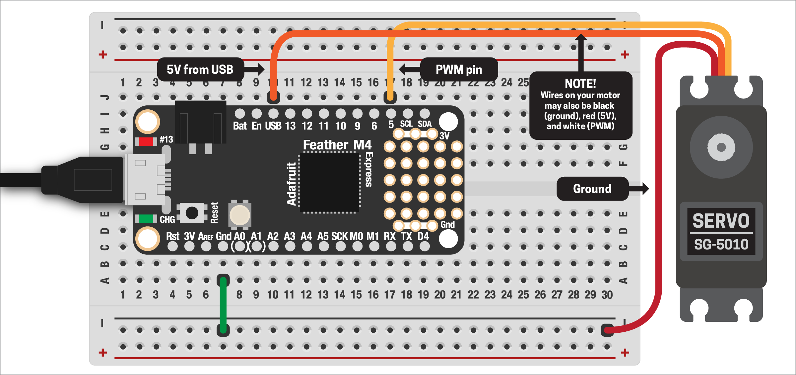

# SERVO MOTOR

There are *lots* of different types of motors out there, all of which have their uses. But for this project, we'll focus on the two kinds of servo motor: *standard* and *continuous*.

If you're interested in a deep-dive into servo motors and all the other types, see [this great post from Adafruit](https://learn.adafruit.com/adafruit-motor-selection-guide).

***

### CONTENTS  

* [Connecting the servo](#connecting-the-servo)  
* [Making the servo move](#making-the-servo-move)  
* [Multiple servos](#multiple-servos)  
* [Full code example](#full-code-example)  
* [Challenges](#challenges)

### STUFF YOU'LL NEED  

* "Standard" servo motor  
* Jumper wires  
* Feather board  
* USB cable  

***

### CONNECTING THE SERVO  
Unlike DC or stepper motors, servos are super easy to hook up! They don't require any additional parts, unless you want to use a bunch of them (see [`Multiple Servos`](#multiple-servos) below).

Servos have three wires:  
* Black (or dark red): ground  
* Red (or orange): 5V  
* White (or yellow): control  

The colors on your motor may vary, but the wires should always be in the same order. The only issue for us is the Feather runs on `3.3V`, not `5V`, so what are we supposed to do? Luckily, the Feather provides us access to the power coming in from the USB connection (whether connected to your computer or just a power supply). USB runs on 5V, so problem solved!

Hook up your servo to your board like this:  

  

***

### MAKING THE SERVO MOVE  
With the motor wired, let's write some code to make it move. First, we need to import some libraries:

```python
import board
import pwmio
import time
```

The servo uses pulse width modulation (PWM) to control it, but doing that yourself would be super messy – lots of precise timing to figure out. Luckily, Adafruit has a motor library that handles all that for us. Copy the entire `adafruit_motor` folder to your board, then add:

```python
from adafruit_motor import servo
```

Finally, we need to set up a PWM pin and connect the motor to it:

```python
pin = pwmio.PWMOut(
  board.D5, 
  duty_cycle = 2**15, 
  frequency = 50
)
motor = servo.Servo(pin)
```

> 🙋‍♀️ What's the deail with `duty_cycle` and `frequency`? TLDR: don't worry about it! The value `2**15` is a fancy way of writing `32,768`, or two to the power of 15. Astute folks might recognize that number as 1/2 the resolution of the analog pins! This means that the pin's duty cycle will be 50%. A frequency of `50` means 50Hz, which is what the motors expect. We don't have to worry about (or modify) these values unless under really unusual circumstances!

With our motor connected, let's make it move! A "normal" servo like this can be given a specific angle and it will move to that position:

```python
motor.angle = 30
```

You'll notice it takes a moment for the motor to get to the correct angle. Adding a `time.sleep()` after each movement will be necessary, otherwise your motor might start behaving weirdly.

You'll also notice that the motor moves really fast! This might be what you want, but what if your project needs slower motion? We can move from one angle to another in discreet steps with small delays between each movement. A for-loop is the perfect way to do this:

```python
for angle in range(30, 150, 5):
  motor.angle = angle
  time.sleep(0.01)
```

This moves from 30º to 150º in 5º increments with a very short delay in between. By changing the delay time, we can speed up or slow down the motion!

***

### MULTIPLE SERVOS  
One motor is cool, but what about *lots* of motors? At first, this seems super easy: we have [17 PWM-capable pins](https://learn.adafruit.com/adafruit-feather-m4-express-atsamd51/pinouts#logic-pins-2994682-7) on the Feather! The problem we'll quickly run into however is power.

The USB connection can provide up to `500mA` (1/2 of an amp) of current at `5V`. To review the [`What Is Electricity?`](https://github.com/jeffThompson/PhysicalComputing/blob/master/Week05_AnalogSensors/Demos/04-WhatIsElectricity.md#current) demo, current is the way parts of our circuit sucks electricity from the power supply. If the power supply has an excess of current available, it's no problem. But if our project tries to pull more current than the supply can provide, it will cause weird bugs or can damage the power supply.

Motors require a lot more current than the sensors and other parts we've used so far. If we want to use more than two servos, the only solution is an external power supply. The servos can run on anything between `4.5–7V` of DC power, so that gives you some wiggle-room. See the [`Selecting a Power Supply`](https://github.com/jeffThompson/PhysicalComputing/blob/master/Week05_AnalogSensors/Demos/04-WhatIsElectricity.md#selecting-a-power-supply) section for more info.

With a suitable power supply in hand, wiring it up is pretty easy! Instead of connecting to `USB` on the board, we'll connect the positive side of the power supply to the motors. Ground should be connected to the Feather's ground: this helps prevent communication problems. The control pin is connected to the board as usual!

***

### FULL CODE EXAMPLE  

```python
import board
import pwmio
import time

# grab the whole 'adafruit_motor' folder
# and add it to your board
from adafruit_motor import servo

# create a PWM pin for our motor, then
# connect the motor to that pin
pin = pwmio.PWMOut(
  board.D5, 
  duty_cycle = 2**15, 
  frequency = 50
)
motor = servo.Servo(pin)

# set an initial angle
motor.angle = 30
time.sleep(1)

while True:
  # rotate from 30–150º
  for angle in range(30, 150, 5):
    motor.angle = angle
    time.sleep(0.01)
  time.sleep(1)

  # and rotate back
  for angle in range(150, 30, -5):
    motor.angle = angle
    time.sleep(0.01)
  time.sleep(1)
```

***

### CHALLENGES  

1. [Semaphore](https://en.wikipedia.org/wiki/Semaphore) is a very old means of visually communicating over large distances. Can you connect two motors and have them spell out words using semaphore?  
2. Timing can be an issue here: `time.sleep()` pauses the entire board, which means nothing else can happen during that period. Keeping track of a start time and duration can be a solution. Can you try implementing something like that?  

